# Spatial vs. spectral resolution and temporal resolution

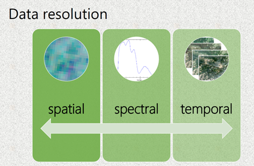

The main information about the spectral, spatial and temporal resolutions of remote sensing data were introduced in Module 2. In this lesson we will discuss consequences of the spatial, spectral and temporal resolutions, mainly on the examples from the Krkonoše Mts. Tundra vegetation (particularly grasslands) showing classification results of the same vegetation species from imagery with different spatial, spectral and temporal resolution.

In the mapping context, different scales play a role: the scale of time, and the scale of spectral and spatial data resolution have to be considered. Considering vegetation studies, an important aspect is the vegetation **unit** as the study object. It is selected depending on what the final map will be used for: do we want to focus on individual species in a specific place, or are we interested in a general but more spatial overview of vegetations communities? Different physiognomies of species in different growing stages can be captured by remote-sensing instruments, depending on the data resolution and date of acquisition. In this context, special attention should be paid to the spatial, spectral and temporal resolutions of acquired data; however, as is well known, they vary for different platforms – satellite, aerial or UAV. For monitoring practice, it is important to achieve a high accuracy of mapped unit classification. Hence, beside the aforementioned aspects, the methods of data processing and analysis play a crucial role. Refer to the methods of the data analysis to Modules 1 and 2.

All above mentioned scales/aspects are interconnected and their evaluation should lead to a better understanding of how remote sensing can improve vegetation monitoring practice. The key aspects of vegetation monitoring using remote sensing that influence the final accuracy are shown in *Figure 1*. 

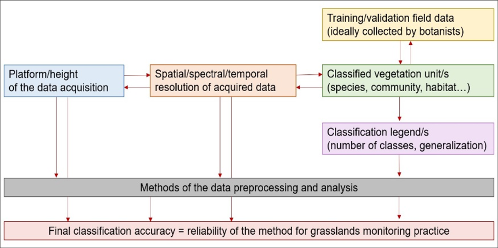

*Figure 1: Key aspects of vegetation monitoring using remote sensing. Source: [Kupková et al. (2021)](#references)*

## Classified vegetation unit 

The minimal mapping unit is usually set according to the goals of the vegetation monitoring and is dependent on the features of available remote-sensing data. Traditionally, vegetation units are delimited based on expert phytosociological knowledge. Since we are analyzing vegetation with the use of remote sensing data, we expect that different units may be ‘visible’ from the sensor. Based on common literature in which vegetation has been classified with remote-sensing data, we can distinguish single species or larger complexes that form communities or habitats, or, ultimately, we may be interested in a vegetation ecosystem as a whole (*Figure 2*). Selecting the appropriate unit that can be classified with specific data allows us to determine the optimal legend of the final map. 

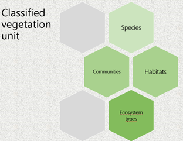

*Figure 2: Vegetation units that can be classified based on mainly spatial resolution of remote sensing data. Source:[Kupková et al. (2021)](#references).*

For example, classifications of grasslands in relict Arctic–alpine tundra of the Krkonoše Mts (Czechia) at the level of habitats and communities (closed alpine grasslands dominated by Nardus stricta, grasses except *Nardus stricta* and subalpine *vaccinium* vegetation) were performed by [Suchá et al. (2016)](#references) and [Kupková et al. (2017)](#references) on satellite remote-sensing data (Landsat 8 and Sentinel-2) with the pixel size 10 – 25 m/pixel using the legend on the level of communities (see *Figure 3* – left part) with satisfactory classification accuracy. However, classification on the species level from this data provided very low reliability. The same studies brought rather good results on the level of selected individual dominant grass species classified from aerial hyperspectral (HS) and multispectral (MS) data with the pixel size around 4 m/pixel (the right part of *Figure 3*). For example, *Nardus stricta* stands were classified with 79% PA and 87% UA from aerial HS data. In the case of *Deschampsia caespitosa*, stands PA reached 88% and 89% UA using the same data. The difference in the legend and classification outputs are presented in *Figure 3*. As it can be seen, the final classification pattern is rather different – caused mainly by different pixel sizes.

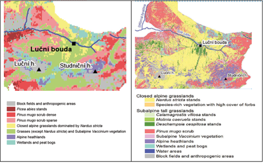

*Figure 3: Classification outputs for different vegetation units from remote sensing data with different spatial resolution (left – Landsat 8, right – hyperspectral sensor APEX). Source: [Suchá et al., 2016](#references) and [Kupková et al. (2017)](#references).**

## Platform (height) of data acquisition 

 

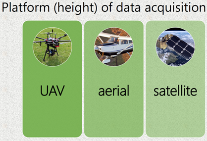

Scale of mapping and related spatial resolution are dependent on the platform used (height of the data acquisition) – see *Table 1*. Each platform has some advantages and weaknesses that are also mentioned.

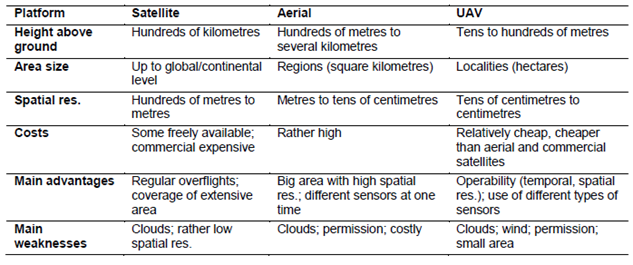

*Table 1: Main features of remote-sensing platforms. Source: [Marcinkowska-Ochytra and Kupková (2021)](#references).*

## Spatial resolution 
Spatial resolution is the main parameter influencing classification detail (the number of legend categories that are distinguishable). In the imagery with different spatial resolution, different level of spatial detail can be distinguished – see *Figure 4*. 

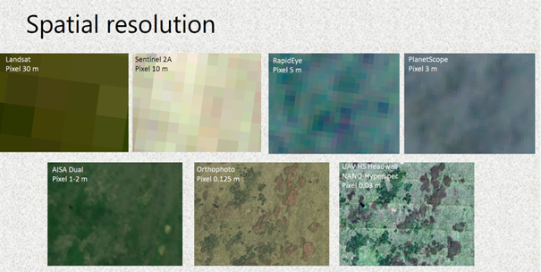

*Figure 4: The same area (Bílá louka meadow – the Krkonoše Mts. captured in the images with different spatial resolutions. Source: [Kupková et al. (2021)](#references).*

To be able to determine the best scale of elaboration, studies that tested different spatial resolutions within the same area and used classification legends with different numbers of categories are important. When we compared data with different spatial resolutions classified for the same area in the Krkonoše Mts, 8 categories (six grass species and two other vegetation categories) were distinguishable from UAV HS and MS data (see *Figure 5* – results for UAV data) with the pixel size 3 cm/pixel. While the legend had to be generalized for satellite and aerial data with bigger pixels. It was not possible to distinguish some less abundant grass categories and individual trees/shrubs in their pixels.

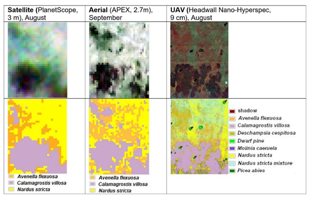

*Figure 5: Data and classification results (research plot Zahrádka; [Kupková et al. (2021)](#references)).*

The other aspect is classification accuracy in case of different number of classified categories. *Figure 6* compares obtained classification accuracies in case of legends with 8, 5 and 3 categories. When pixel size reached centimeters (HS UAV data), and also meters (PlanetScope data), it was possible to classify dominant *Calamagrostis villosa* and *Nardus stricta* species with reasonably high accuracies. 

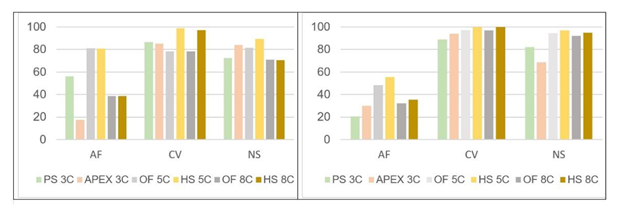

*Figure 6: Best achieved results of PA (left) and UA (right) in % for selected grass categories.  AV – Avenella flexuosa; CV – Calamagrostis villosa; NS – Nardus stricta; PS 3C – PlanetScope data, legend with 3 categories; APEX 3C – APEX data, legend with 3 categories; OF 5C – UAV RGB orthophoto, legend with 5 categories; HS 5C – UAV HS data, legend with 5 categories; OF 8C – UAV RGB orthophoto, legend with 8 categories; HS 8C – UAV HS data, legend with 8 categories). Source: [Kupková et al. (2021)](#references).*

Moreover, the number of classified categories did not play a significant role in final accuracy (see the accuracy of *Calamagrostis villosa* and *Nardus stricta* for HS UAV data or ortophoto using legend with 5 and 8 categories). Meanwhile, for species with low coverage (*Avenella fleuxosa*), even data with extremely high spatial (and spectral) resolution need not provide sufficient accuracy (UA around 50% for HS UAV data with 9 cm pixel). And it seems that higher number of categories leads in this case to a lower classification accuracy (compare UAs and PAs of *Avenella fleuxosa* for orthophoto and HS UAV data using legend with 5 and 8 categories). Smaller pixel size does not always bring better accuracy, the species coverage/abundance and a number of classified categories also play a role. 

## Spectral resolution 

The differentiation between particular species/habitat/communities in available spectral ranges allows them to be classified properly. Thus, we could anticipate in general that hyperspectral data with many narrow contiguous bands and a detailed measurement step (hence a continuous and detailed spectral curve) should yield better classification results than multispectral data with only a few measurements within the whole spectral range. However, according to our experience (see [Kupková et al. (2023)](#references)), if the multispectral sensor includes bands that are important for vegetation resolution (NIR, RedEdge), then excellent classification accuracy can be achieved using a small number of bands (multispectral data). 

In our study ([Kupková et. al, 2023](#references)).   we compared classification accuracy of multispectral data with 8 spectral bands (combination of 5 bands from MicaSense RedEdge M and 3 bands from RGB camera Sony A7 ILCE-7) and hyperspectral data with 54 spectral bands (data from hyperspectral camera Headwall NANO-Hyperspec camera – originally 269 bands, resampled to 54 bands and transformed using MNF transformation to 9 bands). The multispectral and hyperspectral data were obtained from UAV and had the same spatial resolution – 3 cm/pixel. Surprisingly, the higher spectral resolution of hyperspectral data did not increase accuracies, and the results for the multispectral and hyperspectral data were comparable. As *Figure 7* shows, considering best producer’s and user’s accuracies of the four dominant grass species (except of *Avenella flexuosa* and *Carex bigelowi*), there was only a slight difference in classification accuracy between the multispectral and hyperspectral data. Larger differences were found for species with low coverage - *Avenella flexuosa* and *Carex bigelowi*, classified with considerably lower accuracies of ~60% for AF and as low as 48.0% UA for CB. For the F1-score, the multispectral multi-temporal composites generally had better results, but the differences for the dominant species were not significant, compared with the hyperspectral multi-temporal composites.

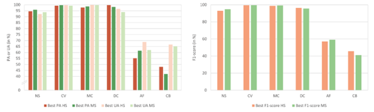

*Figure 7: Best Producer’s accuracy (PA), User’s accuracy (UA) (a), and the F1-score (b) for UAV hyperspectral and MS multispectral for permanent research plot Bílá louka Meadow in the Krkonoše Mts. Species abbreviations: NS - Nardus stricta, CV - Calamagrostis villosa, MC - Molinia caerulea, DC - Deschampsia caespitosa, AF - Avenella flexuosa, CB - Carex bigelowii. Source: [Kupková et al. (2023)](#references).*

## Spectral vs. spatial resolution – which is more important?

The significance of spectral resolution as compared to spatial resolution, and their synergy, is discussed in vegetation mapping studies. The question is which resolution may seem more important in vegetation research.
In Suchá et al. (2016), orthoimages of 12.5-cm pixel and four bands performed better than WorldView-2 satellite data with better spectral resolution (eight bands) and lower spatial resolution (2 m), so spatial resolution proved to be more significant (in both cases, bands were registered in visible and near infrared [VNIR] range) – see *Figure 8*. 

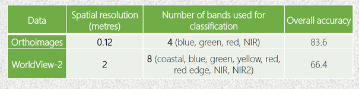

*Figure 8: Comparison of classification accuracies based on data with different spatial and spectral resolution. Source: [Suchá et al. (2023)](#references).*

However, of course, this is not a rule and depends on the type of data and classified units. For example, UAV multispectral data with 1-cm pixel (orthophoto) were classified with significantly lower accuracy than UAV hyperspectral data with 9-cm pixel (OA differ by about 10 percentage points for eight and five legend categories ([Kupková et al., 2021] (#references)). In this case the main problem of the orthophoto was most probably that it did not include near infrared and/or RedEdge bands.
Another study analysed and compared data with similar spectral resolution but different spatial resolution. When vegetation of he Krkonoše Mts. in Poland was classified on spectrally similar APEX (Airborne Prism Experiment) and EnMAP (Environmental Mapping and Analysis Program) data at very different spatial resolutions of 3.12 m and 30 m, respectively, the results for grasslands were both still highly satisfactory (for APEX about 98% UA and PA and for EnMAP 94% PA and 86% UA; Marcinkowska-Ochtyra et al., 2017 [Marcinkowska-Ochtyra et al., 2017] (#references)). However, due to the large EnMAP pixel, it was not possible to distinguish two classes (herbs and ruderal vegetation), so the final legend was developed just for this data. Comparison of these classification outputs is presented on *Figure 9*.

*Figure 9: Comparison of classification outputs from data with similar spectral and different spatial resolution. Source:[ Marcinkowka-Ochytra et al. (2017)](#references).*

As mentioned above, an important feature is the coverage of the vegetation unit in the polygon used for classifier training. In the research where 1-m HySpex data were used for species classification in the Jaworzno Meadows Natura 2000 area in Poland, homogeneous patches of Molinia caerulea species with rare coexistence with other species were determined with high accuracy (more than 80%), while for Calamagrostis epigejos, often co-occurring with Solidago spp., it was difficult (about 60% PA and UA; [Marcinkowska-Ochtyra et al., 2018a] (#references)). Empirical studies have revealed that less than 40% coverage of species results in lower accuracy.

## Temporal resolution
As the physiognomy of vegetation is dynamic in time (during one season) and affected by, for example, weather or management practice, the most important date during the growing season should be indicated for a given species or community/habitat. This specific timing is important because it allows vegetation to be distinguished from background based on knowledge of the specific phenological development of particular classes. For example, the best time for species identification was September for Calamagrostis epigejos, as this was the time of optimum fruit formation, and August for Molinia caerulea, when it was in flower (Marcinkowska-Ochytra et al., 2018a). However, that last date of data acquisition was the beginning of September and Molinia were not yet changing colour, as Schuster et al. (2015) recommend. So, the results could be better if data from near to the end of September were used. The temporal dimension and different phenological phases and thus different possibility to classify individual species is obvious from the *Figure 10*. 

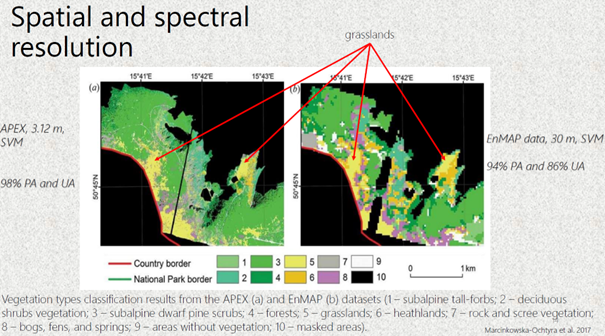

*Figure 10: Temporal dimension –different species can be distinguished in individual dates during the season in UAV multispectral data. Source: ([Kupková et al. (2023)](#references))*

Multi-temporal classification, which takes into account datasets consisting of several terms (within one season) of data acquisition, can be more effective when spectral information from one date is insufficient to distinguish similar categories of vegetation. The significant improvements of classification accuracy using multi-temporal composites was demonstrated for UAV hyperspectral and multispectral data using various classification methods by ([Kupková et al. (2021)](#references)) – see *Figure 11*.

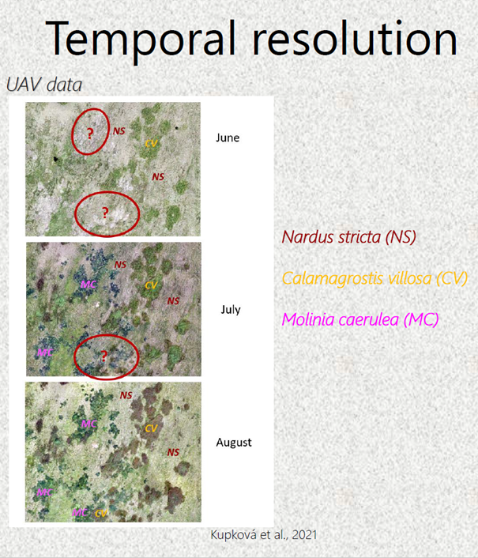

*Figure 11: Comparison of overall accuracies for UAV monotemporal (1-date – July) and multitemporal data (2-date and 3-data – July, August, September) using Maximum likelihood (MLC), Random forest (RF) and Object-based classification (OBIA). Source: ([Kupková et al. (2023)](#references))*

When analysing three grassland Natura 2000 habitats at the Ostoja Nidziańska site in Poland (6210 – semi-natural dry grasslands and scrubland facies, 6410 – *Molinia meadows* and 6510 – lowland hay meadows) HySpex combined data from May, July and September also allowed higher accuracy than single-date data ([Marcinkowska-Ochtyra et al., 2019](#references)). However, July and September datasets provided comparable results (the differences in PA and UA less than 2%) – refer to *Figure 12*.
Figure 12: Differences of classification accuracies using monotemporal and multitemporal datasets for the classification of Nature 2000 habitats.

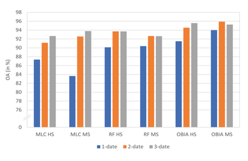

*Figure 12: Differences of classification accuracies using monotemporal and multitemporal datasets for the classification of Nature 2000 habitats. Source: [Marcinkowska-Ochytra et al., 2019](#references).*

In the case of some vegetation types – for example for invasive or expansive species classification the knowledge about the best time for data acquisition is crucial for making the decisions on the proper management of the areas of conservation value. In this example in Jaworzno Meadows in Poland, September connected with the fruiting phase turned out to be the best month to classify *Calamagrostis epigejos* with the highest accuracy – see *Figure 13*.

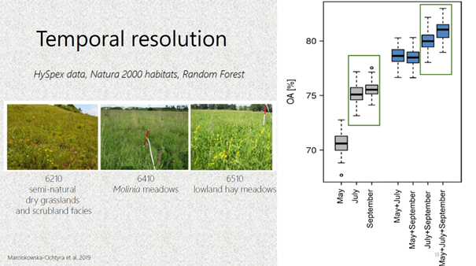

*Figure 13: Different phenological phases of Calamagrostis epigejos captured in HySpex data and comparison of classification accuracies according to the date of individual phenological phase (date of the data acquisitions). Source: [Marcinkowska-Ochytra et al., 2018](#references).*

It is worth emphasizing that there are not many studies that use multi-temporal hyperspectral data for vegetation studies. At the moment they are rather expensive, and the use of satellite data such as Sentinel-2 in this context is valuable. [Wakulińska and Marcinkowska-Ochtyra (2020)](#references) proved that combining the first three out of four analysed terms (31 May, 7 and 27 August, and 18 September) provided the best OA (about 80%; 70–72% for single-date) and, of the eight analysed vegetation classes, the greatest significance was for grasslands. The aspect of high temporal resolution allows denser time series to be used that can lead to even more detailed analysis.

Conclusions

* **Platform** of data acquisition is essential for spatial resolution of images; even today’s advanced satellite technologies cannot provide pixels of tens of cm. 
* Each platform, or type of remote-sensing data, has its own advantages and drawbacks; these must therefore be taken into account when planning a vegetation mapping project (we should consider vegetation unit, detail of mapping, required accuracy, etc.). 
* To achieve the best accuracy on the **species level** it is essential to combine data with very high spatial (cm) and good spectral (bands important for vegetation classification);
* Increased temporal resolution can improve classification accuracy – it is recommended to combine data from the main months of the vegetation season (at least two dates – July and August). A similar relationship is evident in the classification of **habitats/communities** and **types of ecosystem**, but a whole set is not always needed – it is important to choose the best terms. As the unit increases, high spatial resolution is no longer as important as high spectral resolution. 
* When data of resolution below 1 m are not available, the dominant vegetation species can still be classified with rather high **accuracy** from aerial or satellite data with meter resolution, and a classification legend on the level of individual species can be used; however, species with low abundance will be classified with rather low accuracy (less than 60%). 
* Testing of different **legends** (with different number of categories and different levels of generalization) is recommended to reach the best accuracy for different types of data and individual vegetation categories (with regards to the spatial resolution of the data). 
* Collaboration between remote-sensing specialists and botanists is highly recommended for training and validation of data collection and legends elaboration. 
* **Additional variables** can increase the accuracy of results, but it is important to optimize the classification process and decide which variables will be particularly important for the vegetation considered, depending on their physiognomy and their preferred conditions. 
* As for the different **classification methods**, OBIA seems to provide better results for extremely high spatial resolution data. Different pixel-based classifiers could work with different levels of reliability for different data and different vegetation categories. 
When planning a vegetation mapping project all mentioned **types of resolution** should be considered and the most suitable data and methods should be selected for the study goal.

Remote sensing brings special features to vegetation monitoring and is a powerful tool in monitoring practice and nature preservation. However, remote-sensing specialists, organizations and companies, together with practitioners, will have to undertake further research to maximize the reliability of obtained products.

### Next unit
Proceed with a case study on [seasonal spectral separability of selected grass species of the Krkonoše Mts. tundra ecosystem](../08_spectral_separability_grass/08_spectral_separability_grass.md)

## References

Ali I., Cawkwell F., Dwyer E., Barrett B. and Green S. (2016) Satellite remote sensing of grasslands: from observation to management. Journal of Plant Ecology 9, 649-671. 

Bock M., Xofis P., Mitchley J., Rossner G. and Wissen M. (2005) Object-oriented methods for habitat mapping at multiple scales – Case studies from Northern Germany and Wye Downs, UK. Journal for Nature Conservation 13, 75-89. 

Feilhauer H., Dahlke C., Doktor D. Lausch A., Schmidtlein S., Schulz G., Stenzel S. (2014) Mapping the local variability of Natura 2000 habitats with remote sensing. Applied Vegetation Science 17, 765-779. 
Jensen R.H. (2005) Introductory Digital Image Processing. A Remote Sensing Perspective. Pearson Prentice Hall 

Kupková L., Červená L., Suchá R., Zagajewski B., Březina S. and Albrechtová J. (2017) Classification of Tundra Vegetation in the Krkonoše Mts. National Park Using APEX, AISA Dual and Sentinel-2A Data. European Journal of Remote Sensing 50, 1, 29-46. 

Kupková L., Červená L. and Lysák J. (2021) Grassland mapping using remote sensing data acquired from different platforms. Charles University Prague. Unpublished manuscript. 

Kupková, L., Červená,L., Potůčková, M., Lysák, J., Roubalová, M., Hrázský,Z., Březina, S., Epstein, H.E., Müllerová, J. 2023. Towards reliable monitoring of grass species in nature conservation: Evaluation of the potential of UAV and PlanetScope multi-temporal data in the Central European tundra, Remote Sensing of Environment, Volume 294, 2023, 113645, ISSN 0034-4257, https://doi.org/10.1016/j.rse.2023.113645.

Marcinkowska-Ochtyra A., Gryguc K., Ochtyra A., Kopeć D., Jarocińska A. and Sławik Ł. (2019) Multitemporal Hyperspectral Data Fusion with Topographic Indices—Improving Classification of Natura 2000 Grassland Habitats. Remote Sensing 11, 2264.
Marcinkowska-Ochtyra A., Jarocińska A., Bzdęga K. and Tokarska-Guzik B. (2018a) Classification of Expansive Grassland Species in Different Growth Stages Based on Hyperspectral and LiDAR Data. Remote Sensing 10(12), 2019. 

Marcinkowska-Ochtyra A., Zagajewski B., Raczko E., Ochtyra A. and Jarocińska A. (2018b) Classification of high-mountain vegetation communities within a diverse giant mountains ecosystem using Airborne APEX Hyperspectral Imagery. Remote Sensing 10, 570. 

Marcinkowska-Ochtyra A., Zagajewski B., Ochtyra A., Jarocińska A., Wojtuń B., Rogass Ch., Mielke Ch. and Lavender S. (2017) Subalpine and alpine vegetation classification based on hyperspectral APEX and simulated EnMAP images. International Journal of Remote Sensing 38(7), 1839-1864. 

Marcinkowska-Ochtyra A. and Kupková L. (2021): Grassland vegetation monitoring: scale is important. Grassland Science in Europe, Vol. 26 – Sensing – New Insights into Grassland Science and Practice  

Schuster C., Schmidt T., Conrad C., Kleinschmit B. and Förster M. (2015) Grassland habitat mapping by intra-annual time series analysis -Comparison of RapidEye and TerraSAR-X satellite data. International Journal of Applied Earth Observation and Geoinformation 34, 25-34. 

Suchá R., Jakešová L., Kupková L. and Červená L. (2016): Classification of vegetation above the treeline in the Krkonoše Mts. National Park using remote sensing multispectral data. AUC Geographica 51(1), 113-129. 

Wakulińska M. and Marcinkowska-Ochtyra A. (2020) Multi-Temporal Sentinel-2 Data in Classification of Mountain Vegetation. Remote Sensing 12, 2696.
