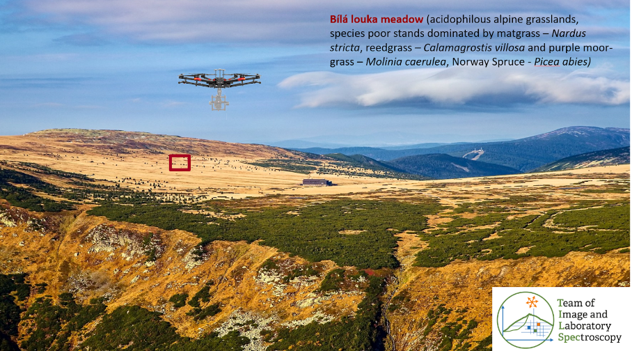
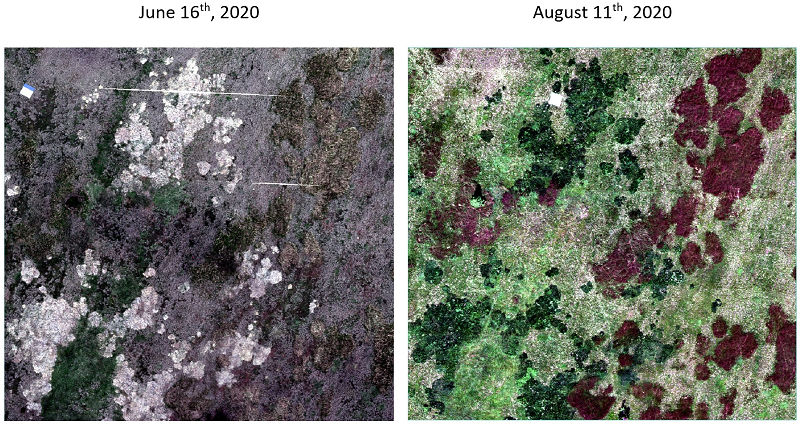
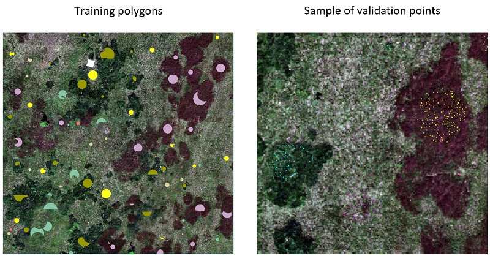
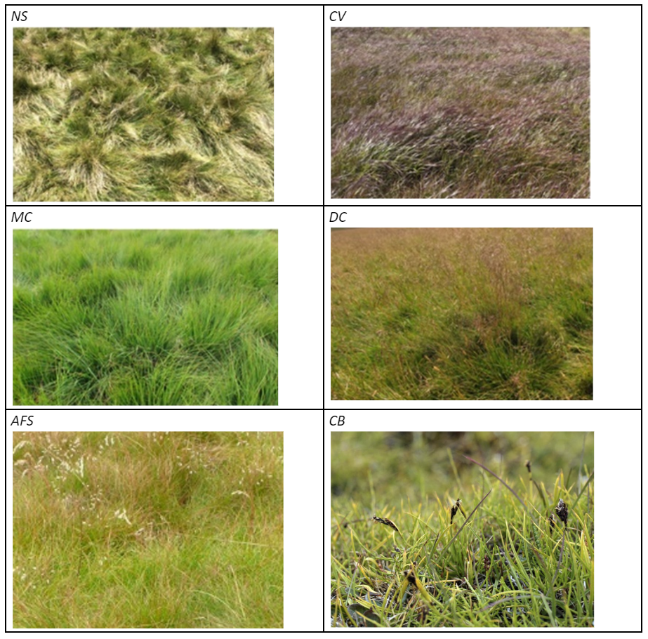

# Case study: monitoring tundra grasslands in the Krkonoše Mountains

## Introduction

This case study presents data, methods, and results elaborated in the Krkonoše Mts. National Park by our [TILSPEC](tilspec.cz) team at Charles University Prague, 
within the project “Development of methods for monitoring of the Krkonoše Mts. tundra vegetation changes using multispectral, hyperspectral and LIDAR sensors from UAV”. 
Important results of the project have been published in [Kupková et al. (2023)](#references). 
As we proved in this study, time series (in this case, a multitemporal UAV intra-seasonal dataset) can improve vegetation classification accuracy in comparison with one-date images. 
Following our research, the classification accuracy of selected tundra grass species derived from mono- and multitemporal (within one season) hyperspectral RPAS imagery is compared based on reference botanical datasets collected in the Krkonoše Mts. in 2020. 
Also tested is the influence of the pre-processing step, comprising the minimum noise fraction (MNF), on classification accuracy. The RF classification is carried out in R. 

*Figure 1. Image of study area near to Luční bouda hut in the Krkonoše Mts. National Park – permanent research plot Bílá louka meadow (red).*

## Objectives

* To classify grass vegetation in the Krkonoše Mts. on permanent research plot 100 x 100 m (see Figure 1) using Random Forest classifier (script in R) from UAV hyperspectral data acquired by Headwall NANO-Hyperspec pushbroom camera.
  
* To evaluate and quantify a potential improvement in classification accuracy of the multi-temporal time series compared to mono-temporal imagery.
  
* To evaluate the influence of MNF transformation on the final classification result (optional part).

## Questions to be answered

* Is it possible to classify individual grass species from a mono-temporal UAS dataset with very high spatial resolution (9cm) and spectral resolution (54 bands) with an overall accuracy higher than 85%?
  
* What can be the classification accuracy of the dominant and sparse growth species?
  
* Can we reach higher accuracy using time series of intra-seasonal data? How big are the differences?
  
* Optional: Can transformation of image data that reduces noise and  data dimensionality (MNF transformation) bring better results in comparison with original hyperspectral dataset?

## Data

We will use:

* Hyperspectral image data acquired by Headwall Nano-Hyperspec® camera fastened on the DJI Matrice 600 Pro drone on 16th June and 11th August 2020 (Figure 2) with ground sampling distance 9 cm and spectral resolution 54 bands (resampled from 269 bands to reduce correlation in neighboring bands) – files:
            `BL_202006.tif (data from June; 54 bands, for visualization in true colors use bands R-21/G-13/B-7)`  
            `BL_202008.tif (data from August; 54 bands, for visualization in true colors use bands R-21/G-13/B-7)`  
            `BL_2020_0608MT.tif (multitemporal image – merged dataset from June and August, 108 bands)`

* Image data transformed using MNF transformation (10 bands, ground sampling distance 9 cm) -file:  
            `BL_MNF_08_10 (10 output bands from MNF transformation)`

* Field reference dataset (*Figure 3*) collected by botanists (in 2019 and 2020) divided between training data (polygons) and validation data (points). For the explanation how the reference dataset was collected and divided between training and validation data see [Kupková et al. (2023)](#references).  
            `File with training data: train_polygons.zip`  
            `File with reference data: valid_points.zip`

*Figure 2. Hyperspectral data – imagery from Headwall Nano-Hyperspec® camera used for classification*

*Figure 3. Reference data – training polygons and an example of validation points*

### Classification scheme

The classification scheme (*Figure 4*) includes four categories of dominant grass species, one originally common species (*Nardus stricta, NS*), and three currently expanding grasses: *Calamagrostis villosa (CV), Molinia caerulea (MC)* and *Deschampsia cespitosa*. Also, species with sparse growth on the permanent research plot - *Avenella flexuosa (AFS), Carex bigelowii (CB)* and *Picea abies (PAb)* were classified.

*Figure 4. Classified grassland species.*

### Next unit
Proceed with a case study on [seasonal dynamics of flood-plain forests](../07_flood_plain_forest/07_flood_plain_forest.md)

