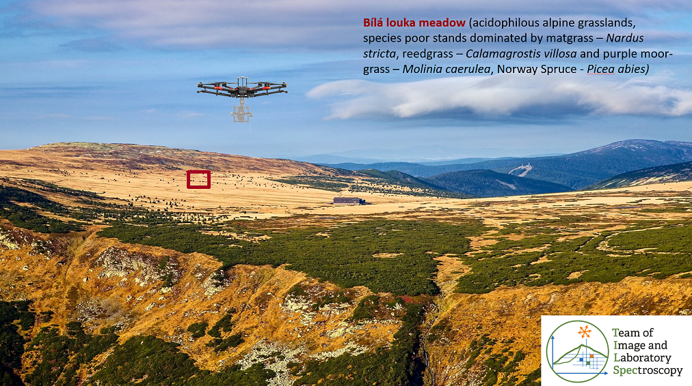
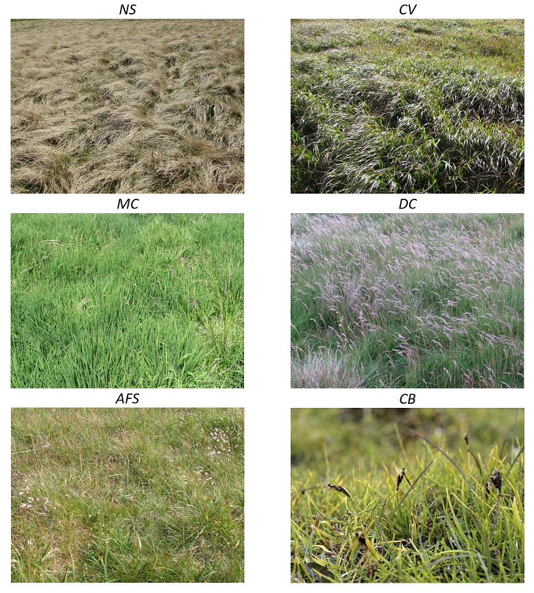

# Case study: Discrimination of selected grass species from time series of RPAS hyperspectral imagery

## Introduction

This case study presents data, methods, and results elaborated in the Krkonoše Mts. National Park by our [TILSPEC](https://www.tilspec.cz) team at Charles University Prague, 
within the project “Development of methods for monitoring of the Krkonoše Mts. tundra vegetation changes using multispectral, hyperspectral and LIDAR sensors from UAV”. 
Important results of the project have been published in [Kupková et al. (2023)](#references). 
As we proved in this study, time series (in this case, a multitemporal UAV intra-seasonal dataset) can improve vegetation classification accuracy in comparison with one-date images. 
Following our research, the classification accuracy of selected tundra grass species derived from mono- and multitemporal (within one season) hyperspectral RPAS imagery is compared based on reference botanical datasets collected in the Krkonoše Mts. in 2020. 
Also tested is the influence of the pre-processing step, comprising the minimum noise fraction (MNF), on classification accuracy. The RF classification is carried out in R. 

<p align="center">

</p>

*Figure 1. Image of study area near to Luční bouda hut in the Krkonoše Mts. National Park – permanent research plot Bílá louka meadow (red).*

## Objectives

* To classify grass vegetation in the Krkonoše Mts. on a permanent research plot 100 x 100 m (*Figure 1*) using Random Forest classifier (script in R) from UAV hyperspectral data acquired with the Headwall NANO-Hyperspec pushbroom camera.
  
* To evaluate and quantify a potential improvement in classification accuracy of the multi-temporal time series compared to mono-temporal imagery.
  
* To evaluate the influence of MNF transformation on the final classification result. (optional)

## Questions to be answered

* Is it possible to classify individual grass species from a mono-temporal UAS dataset with very high spatial resolution (9 cm) and spectral resolution (54 bands) with an overall accuracy higher than 85%?
  
* What is the classification accuracy of the dominant and sparse growth species?
  
* Can we reach higher accuracy using time series of intra-seasonal data? How significant are the differences?
  
* Optional: Can image data transformation that reduces noise and data dimensionality (MNF transformation) produce better results than the original hyperspectral dataset?

## Data

We will use ([module4/case_study_discrimination_grass_species](https://doi.org/10.5281/zenodo.10003574)):  

* Hyperspectral image data acquired with the Headwall Nano-Hyperspec® camera fastened on the DJI Matrice 600 Pro drone on June 16 and August 11 2020 (*Figure 2*), with ground sampling distance of 9 cm and spectral resolution of 54 bands (resampled from 269 bands to reduce correlation in neighboring bands):  
            `BL_202006.tif (data from June; 54 bands, for visualization in true colors use bands R-21/G-13/B-7)`  
            `BL_202008.tif (data from August; 54 bands, for visualization in true colors use bands R-21/G-13/B-7)`  
            `MNF_08_10.tif (MNF transformed image from August; first 10 bands)` 
              
* Field reference dataset (*Figure 3*) collected by botanists (in 2019 and 2020) divided between training data (polygons) and validation data (points). For an explanation of how the reference dataset was collected and divided between training and validation data, see [Kupková et al. (2023)](#references):  
            `train_polygons.zip (training data)`  
            `valid_points.zip (validation data)`


<p align="center">

</p>

*Figure 2. Hyperspectral data – imagery used for classification.*

<p align="center">

</p>

*Figure 3. Reference data – training polygons and an example of validation points.*


### Classification scheme

The classification scheme (*Figure 4*) includes four categories of dominant grass species: one originally common species (*Nardus stricta, NS*) and three currently expanding grasses *Calamagrostis villosa (CV), Molinia caerulea (MC)*, and *Deschampsia cespitosa*. Also, species with sparse growth on the permanent research plot were classified : *Avenella flexuosa (AFS), Carex bigelowii (CB)*, and *Picea abies (PAb)*.


<p align="center">

</p>

*Figure 4. Classified grassland species.*

## Methodology  
### 1. Random forest classification in R
For RF classification [(Belgiu and Drăgut, 2016; Breiman, 2001)](#references) in R software, we will use the ‘randomForest’ package [(Liaw and Wiener, 2002)](#references). 
Random Forest represents one of the increasingly used machine learning methods. 
This classifier creates a specified number of decision trees (Ntree parameter) from the training data to determine the class membership. 
Each such tree is built for randomly selected training data, with decision rules formed by a random subset of features (feature variables) of a specified size (the Mtry parameter). 
The resulting class of each pixel in the image is then determined by the voting result of each decision tree.

This classifier has the advantage of reduced sensitivity to noise in the data as well as high accuracy when dealing with voluminous data [(Belgiu and Drăguţ, 2016)](#references).

In our study, we used various combinations of two input parameters to test the RF classifier: the number of trees (`ntree`) and the number of input variables (features) randomly sampled at each split (`mtry`).
The best results were achieved for the `ntree` value of 1000.
The tests performed on `mtry` values showed that the default `mtry` value was sufficient.

Besides the spectral features (retrieved from the original/transformed bands), we will also use standard textural features (mean texture, variance, homogeneity, contrast, dissimilarity, entropy, second moment) [(Haralick et al., 1973)](#references) calculated by using the Gray-Level-Co-Occurrence Matrix (GLCM) in the ‘glcm’ R package [(Zvoleff, 2020)](#references) with a window size of 3 x 3 pixels and default parameter settings. 
These variables were selected based on the values of the Importance score. 
The Importance score (see an example in Appendix 1) can be generated as one of the outputs from RF classifications and shows the importance of feature variables. 
Features with high values for this score are generally regarded as more important.

Use the provided <a href=06_Krkonose_tundra_grasslands.R download>code in R</a>, which can be seen below, to classify the monotemporal hyperspectral datasets from June `BL_202006.tif` and August `BL_202008.tif` 2020, multitemporal composite, and MNF transformed image.  
The script is self-explanatory, with comments and instructions following `#`. Don't forget to set the working directory and adapt the input data paths according to your data structure. 
Be aware that the computation is time-consuming. Thus, example result classification rasters are also be provided with the data. 
```
# =============================================================================
# Import libraries
# This loads required packages (and installs them if necessary)
l_packages <- c("raster", "rgdal", "randomForest", "glcm", "spacetime")
for (package in l_packages){
  if(! package %in% installed.packages()){
    install.packages(package, dependencies = TRUE)
  }
  library(package, character.only = T)
}

# Set working directory - insert path to your data
setwd("c:/path/to/data")
getwd()

# =============================================================================
# 1.
# Monotemporal dataset - uncomment this part to perform classification on one of the monotemporal datasets
# =============================================================================
# Load input hyperspectral (HS) image
img <- brick("BL_202006.tif")
# Assign band names to image
names(img) <-  paste0("B", c(1:54))

# =============================================================================
# 2.
# Multitemporal composite - uncomment this part to composite the two datasets
# =============================================================================
#img_1 <- brick("BL_202006.tif")
#img_2 <- brick("BL_202008.tif")
#img   <- stack(img_1, img_2)
# Assign band names to image
#names(img) <-  paste0("B", c(1:108))


# =============================================================================
# Load training data
# =============================================================================
# Load vector training data
training <- readOGR(dsn=getwd(), layer="train_polygons") # dsn name of folder containing shp, with the name in layer
View(training)

# Vizualize of image and training data for control
plot(img$B3)
plot(training, bg="transparent", add=TRUE)

# =============================================================================
# Feature extraction
# =============================================================================
# Calculate GLCM textures from each spectral band
# TAKES LONG TIME!!!
out <- list()
for(band in 1:dim(img)[3]) {
  out[band] <- glcm::glcm(img[[band]], window = c(3, 3), na_opt = 'center', 
                       statistics = c("mean", "variance", "homogeneity", "contrast",
                                      "dissimilarity", "entropy", "second_moment"))
  print(paste0('Finished computing textures for band #', band, '/', dim(img)[3]))
}
textures <- stack(out)

# Stack image and textures
predictors <- stack(img, textures)

# Preparation of training data
# Extract raster values from training polygons
df_features <- extract(predictors, training, df=TRUE) # TAKES LONG TIME!!!

# Remove rows with nodata values
training <- na.omit(df_features)
# Rename column ID to Classvalue
names(training)[names(training) == 'ID'] <- 'Classvalue'

# See number of features for each class
table(training$Classvalue)

# =============================================================================
# Train + Apply a RF model
# =============================================================================
# TAKES LONG TIME!!
model <- randomForest(as.factor(Classvalue) ~.,data=training,
                      ntree=100, importance=TRUE, do.trace=50) ### original model had ntree=1000

# Classify image using trained model
predicted <- predict(predictors, model)

# Vizualize classification
plot(predicted, main = 'Classification Random Forest')

# Print information about the trained model
model

# =============================================================================
# Export results
# =============================================================================
# Export feature importance table
feature_importance <- model$importance
write.table(feature_importance, "BL_202006_RF_feature_importance.txt")

# Save classification as a raster
writeRaster(predicted, filename="BL_202006_RF_classified.tif",overwrite=TRUE)
Sys.time()
```

The script outputs a classified raster `*tif`, the coordinate system/projection (S-JTSK/Krovak East North, EPSG: 5514) needs to be defined along with the color information and class names.
This can be done in the QGIS software package or in R with the following code snippet:  
```crs("image_filename") <- "+proj=krovak +ellps=bessel"```.  
The feature importance output file `*txt`, column `MeanDecreaseAccuracy`, shows the importance of each band in the classification process.  

### 2. Accuracy assessment
Assessment should be elaborated in the GIS environment (AcaTaMa plugin or Semi-Automatic Classification plugin for QGIS). Use the provided validation points, `valid_points.zip`, to compute the accuracy scores. Select the classified raster to be evaluated, and compare the classification output with class values at validation samples. Compute the [confusion matrix](../../module1/06_reference_data_validation_accuracy_assessment/06_reference_data_validation_accuracy_assessment.md#accuracy-metrics) and derive the overall accuracy, precision, recall, and F1-score. 

| Class/Species | Number |
| :---: | :---: |
| afs | 1 |
| cv | 2 |
| cxbig | 3 |
| desch | 4 |
| mol | 5 |
| nard | 6 |
| smrk | 7 |

## Tasks  
1. Use the provided R script to classify:   
    - image from June 2020
    - image from August 2020
    - multitemporal composite from June and August 2020
    - MNF transformed image.  
2. Perform accuracy assessment of all classification outputs.  
3. Prepare a report – present shortly used methodology, overall accuracies, and F1-scores of all classification outputs, comment and compare the results for:
    - mono-temporal and multitemporal images.  
4. Discuss the results. 
5. Try to answer the questions from the introduction of the case study.  

## Acknowledgement  

We want to thank the project “Development of methods for monitoring of the Krkonoše Mts. tundra vegetation changes using multispectral, hyperspectral and LIDAR sensors from UAV” supported by the European fund of regional development and European fund for projects in environmental protection.

## References

Kupková, L., Červená,L., Potůčková, M., Lysák, J., Roubalová, M., Hrázský, Z., Březina, S., Epstein, H.E., Müllerová, J. 2023. Towards reliable monitoring of grass species in nature conservation: Evaluation of the potential of UAV and PlanetScope multi-temporal data in the Central European tundra, Remote Sensing of Environment, 294, 113645. ISSN 0034-4257. [10.1016/j.rse.2023.113645](https://doi.org/10.1016/j.rse.2023.113645). 

Belgiu, M. and Dragut, L. 2016. Random Forest in Remote Sensing: A Review of Applications and Future Directions. ISPRS Journal of Photogrammetry and Remote Sensing, 114, 24-31.
[10.1016/j.isprsjprs.2016.01.011](https://doi.org/10.1016/j.isprsjprs.2016.01.011).

Breiman, L. 2001. Random Forests. Machine Learning, 45, 5-32. [10.1023/A:1010933404324](http://dx.doi.org/10.1023/A:1010933404324).

Haralick, R. M., Shanmugam, K., Dinstein, I. 1973. Textural Features for Image Classification. IEEE Transactions on Systems, Man, and Cybernetics, 3, 6, 610-621. [10.1109/TSMC.1973.4309314](https://doi.org/10.1109/tsmc.1973.4309314).

Zvoleff, A. 2016. GLCM: calculate textures from grey-level co-occurrence matrices (GLCMs). [github.com/azvoleff/glcm](https://github.com/azvoleff/glcm).


### Case study results 
Proceed to case study [example results](solution/06_Krkonose_tundra_grasslands_solution.md)

### Next unit
Proceed with a case study on [seasonal dynamics of flood-plain forests](../07_flood_plain_forest/07_flood_plain_forest.md)

