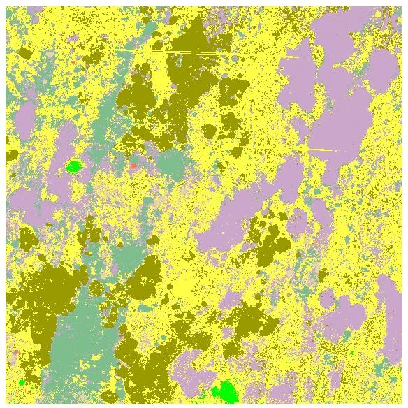
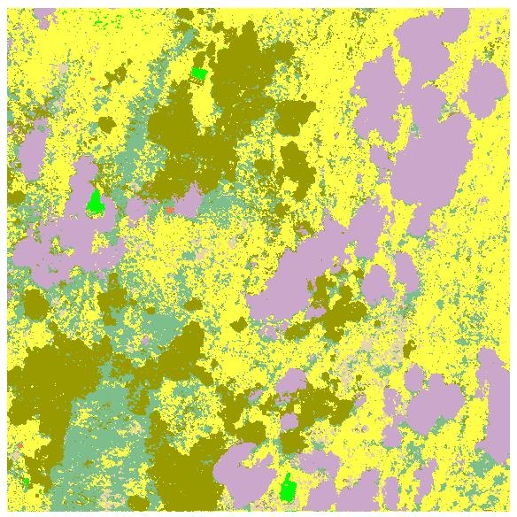
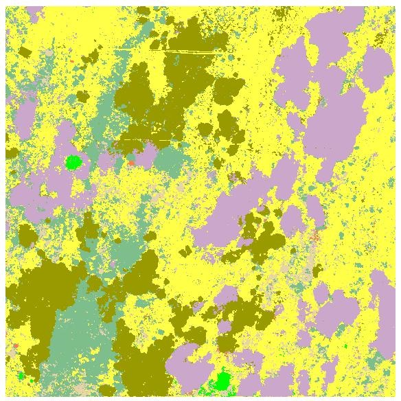
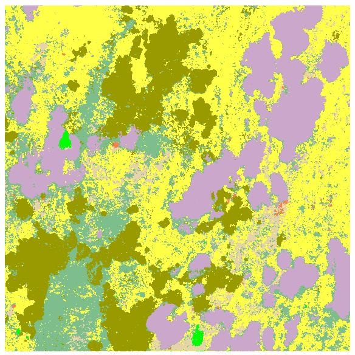
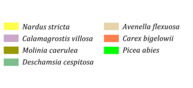

## Example results

#### Random forest classification in R

| Image | Classification |
| :---: | :---: |
| June |  |
| August |  |
| June + August |  |
| August MNF |  |

<i>Classification legend</i>

#### Accuracy assessment

|  | June | OA=85.91% |  |  | August | OA=88.03% |  |
|:---:|:---:|:---:|:---:|:---:|:---:|:---:|:---:|
| **Class** | *Recall* | *Precision* | *F1-score* |  | *Recall* | *Precision* | *F1-score* |
| *afs* | 29.13 | 48.05 | 36.27 |  | 29.13 | 56.92 | 38.54 |
| *cv* | 96.89 | 86.16 | 91.21 |  | 99.42 | 99.13 | 99.27 |
| *cxbig* | 0.00 | 0.00 | 0.00 |  | 0.00 | 0.00 | 0.00 |
| *desch* | 87.30 | 87.30 | 87.30 |  | 80.95 | 74.45 | 77.56 |
| *mol* | 88.12 | 95.10 | 91.48 |  | 96.62 | 94.07 | 95.33 |
| *nard* | 79.28 | 71.56 | 75.22 |  | 85.62 | 75.70 | 80.35 |
| *smrk* | 90.00 | 97.83 | 93.75 |  | 26.00 | 92.86 | 40.63 |

|  | June + August | OA=92.60% |  |  | August MNF | OA=91.89% |  |
|:---:|:---:|:---:|:---:|:---:|:---:|:---:|:---:|
| **Class** | *Recall* | *Precision* | *F1-score* |  | *Recall* | *Precision* | *F1-score* |
| *afs* | 41.73 | 47.75 | 44.54 |  | 51.18 | 54.62 | 52.84 |
| *cv* | 99.22 | 98.08 | 98.65 |  | 99.42 | 99.22 | 99.32 |
| *cxbig* | 10.00 | 62.50 | 17.24 |  | 18.00 | 81.82 | 29.51 |
| *desch* | 90.00 | 86.04 | 87.98 |  | 90.63 | 84.72 | 87.58 |
| *mol* | 97.58 | 99.02 | 98.29 |  | 98.07 | 97.60 | 97.83 |
| *nard* | 93.23 | 86.81 | 89.91 |  | 84.57 | 82.82 | 83.69 |
| *smrk* | 92.00 | 97.87 | 94.84 |  | 72.00 | 100.00 | 83.72 |

#### Q&A

* Is it possible to classify individual grass species from a mono-temporal UAS dataset with very high spatial resolution (9 cm) and spectral resolution (54 bands) with an overall accuracy higher than 85%?  
    + yes, both of the mono-temporal datasets (June and August) achieved an OA above 85%
    + however, the precision and recall varied for different species
* What is the classification accuracy of the dominant and sparse growth species?  
    + dominant grass species (cv, mol, nard, desch) reach excellent accuracy; sparse species not so much
    + abundance/density/homogeneity of the species and its cover are essential for classification accuracy
* Can we reach higher accuracy using time series of intra-seasonal data? How significant are the differences?  
    + accuracy increased with spatial resolution; multitemporal composite from June and August 2020 reached the highest OA of 92.6%
* Optional: Can image data transformation that reduces noise and data dimensionality (MNF transformation) produce better results than the original hyperspectral dataset?  
    + yes, the MNF transformed image OA is 91.89%, which corresponds to a 3.96 % increase when compared to the classification of the original August dataset
    
### Back to case study
Proceed by returning to [Discrimination of selected grass species from time series of RPAS hyperspectral imagery](../06_Krkonose_tundra_grasslands.md)