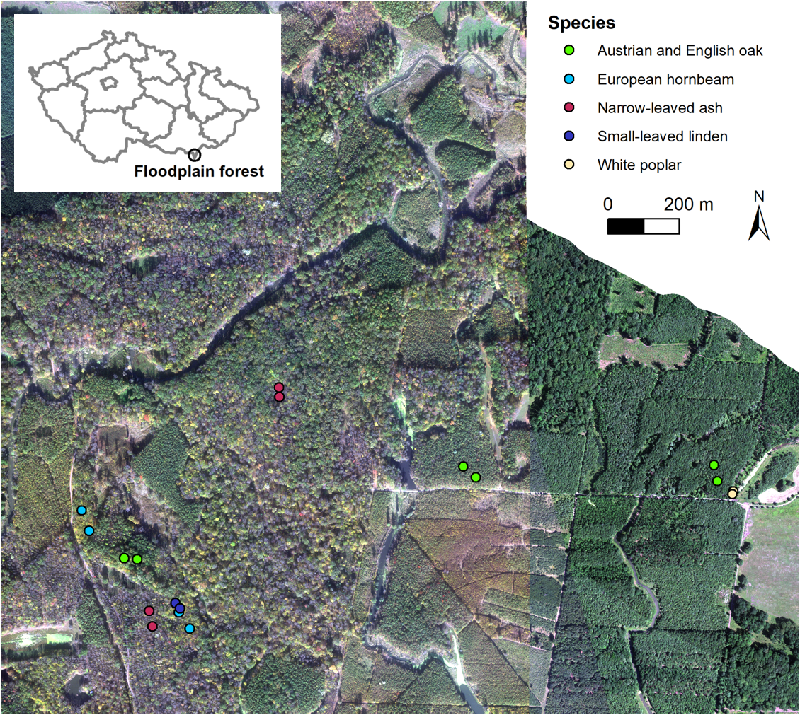
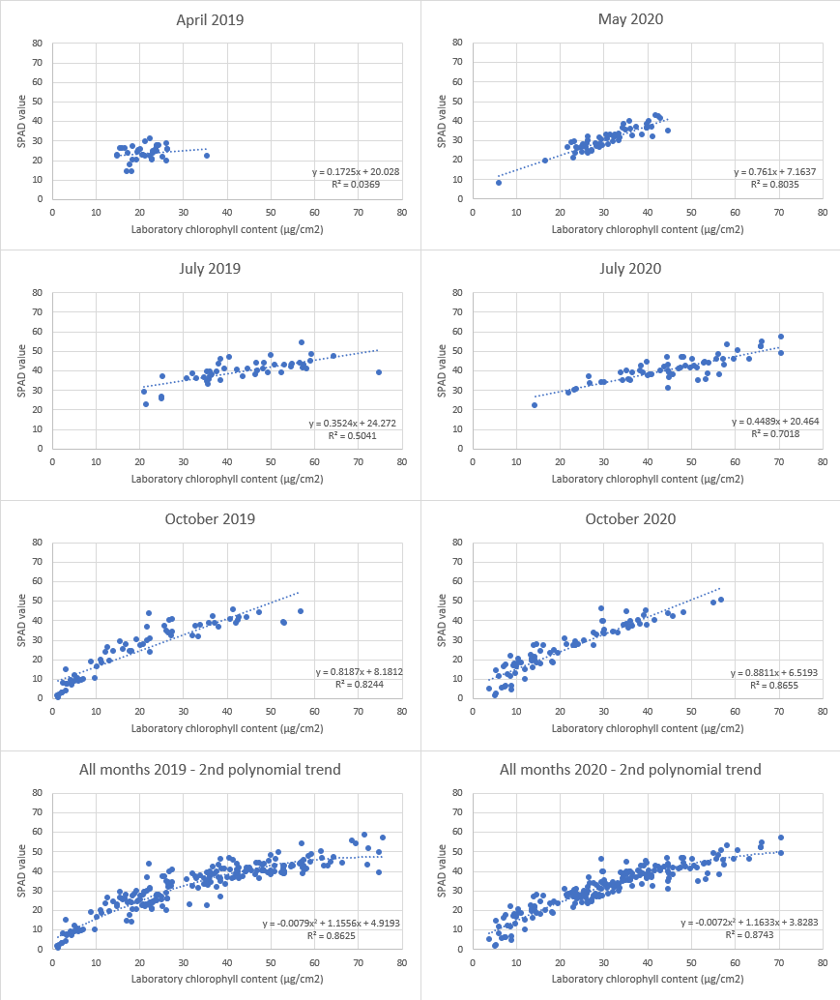
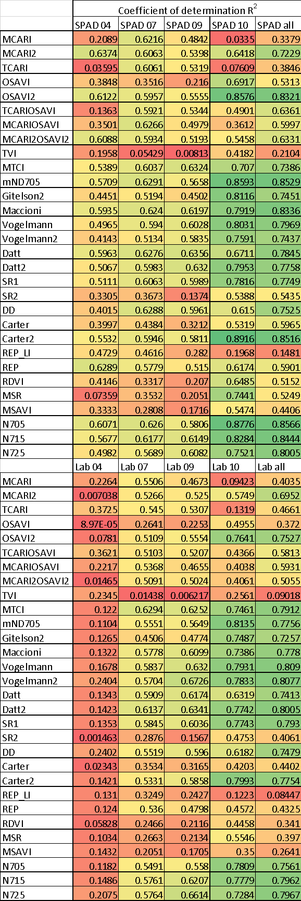
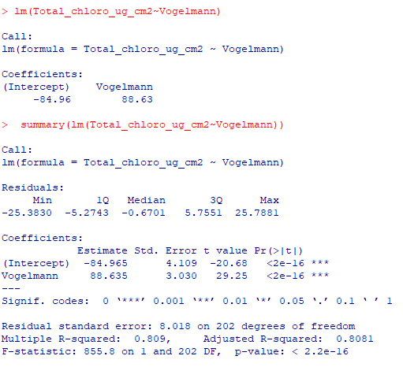
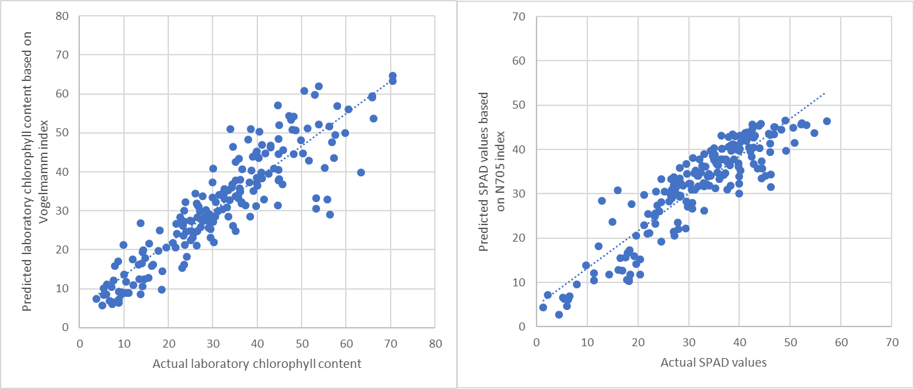

# Case study: seasonal dynamics of flood-plain forests

The overall condition of a plant or an entire ecosystem is often assessed by its chlorophyll content. To be able to obtain or validate absolute values of chlorophyll content from remote sensing data, reliable ground truth data sets are needed. Non-destructive measurements using various portable chlorophyll meters are often used as the ground truth data in remote sensing studies. The objectives of this case study are as follows:


## Objectives

The objectives of this case study are as follows:

* To estimate the accuracy of chlorophyll content measured by portable transmittance-based chlorophyll meter SPAD-502 by comparison with a laboratory reference. 

* To calculate chlorophyll indices based on spectra measured by the spectroradiometer ASD FieldSpec4 Standard-Res coupled with integrating sphere and to build and validate empirical models between indices and chlorophyll content.

* To compare the performance of empirical models using data from the whole vegetation season and models built based on the data just from one term. 

The case study will be presented on a data set from a floodplain forest in Czechia where all the measurements were conducted on the set of various deciduous trees during the vegetation periods of 2019 and 2020. 


## Data

A dataset was acquired in The Soutok floodplain forest district located between the rivers Morava and Dyje (48.68° N, 16.94° E) in 2019 (four field campaigns conducted in April, July, September and October; 204 samples in total) and 2020 (three field campaigns in May, July, October; 193 samples in total). During each field campaign, sunlit and shaded branches were trimmed with a tree climber from eighteen deciduous trees of six species: Austrian oak, English oak, Narrow-leaved ash, European hornbeam, White poplar and Small-leaved linden (*Figure 1*). 
Representative leaves of all types (small, big, green, colored, young, old) were measured using chlorophyll meter SPAD-502 and ASD FieldSpec4 Standard-Res spectroradiometer (sampling 350 – 2,500 nm spectral domain) coupled with an integrating sphere RTS-3ZC and then taken to the laboratory for spectrophotometric determination of chlorophyll content from dimethylformamide extracts (*Figure 2*). Let’s use data from 2019 for training purposes and data from 2020 for validation of the results.

Input data file `FloodplainForest_input_data.xlsx` consists of two sheets: `2019_training` and `2020_validation`. Data are also available in text files separated by tabulator for work in R (`FloodplainForest_2019_training.txt` and `FloodplainForest_2020_validation.txt`). All the files have the same columns: 

* CampNo_year – field campaign number (1 to 7) and year (19 for 2019, 20 for 2020)
* Month – month when the data were measured
* Species – tree species
* TreeNo – number of sampled tree 
* ID_Biochem – ID of leaf used for chlorophyll measurement
* SPAD_Cab – SPAD value correlating with content of chlorophyll a+b
* Total_chloro_ug_cm2 – Total chlorophyll content in μg/cm2 extracted in laboratory (further in text as laboratory chlorophyll content)
* 350 – 2500 – reflectance at the given wavelength measured by the spectroradiometer

<p align="center">

</p>

*Figure 1. Map of the study area showing the location of 18 sampled trees; aerial hyperspectral CASI data are used as the background.*


<p align="center">

</p>

*Figure 2. Examples of sampled leaves in October 2020 (up), the field laboratory (down).*

## Chlorophyll meter vs. laboratory chlorophyll content

Firstly, let’s explore a relation between both methods of chlorophyll content determination and seasonal changes of chlorophyll content. By building simple regressions (https://en.wikipedia.org/wiki/Simple_linear_regression, table editor: `XY point graph / add trendline` or R: lm(SPAD_Cab ~ Total_chloro_ug_cm²) for each month (April 2019, May 2020, July 2019, July 2020, September 2019, October 2019, October 2020) and each year (all measurements from  2019 and all measurements from  2020) we can see how both values are correlated and how the chlorophyll content and the correlation values change during the 2019 and 2020 seasons (*Figure 3*). At the very beginning of the season the variability in data is so small, that the correlation doesn’t work (April 2019, R² = 0.04). In May the correlation become stronger, which is consistent with some studies that have looked for the most appropriate term to distinguish among different deciduous tree species and found out that the end of May is ideal as the phenology of one species is synchronized well but inter-species differences are still visible ([Lisein et al., 2015; Grybas and Congalton, 2021](#references)). Our result (R² = 0.8) is influenced by two outliers but when they are removed, the correlation is still very good with R² = 0.73, not shown in *Figure 3*). In July the correlations are again weaker (July 2019 – R² = 0.50, July 2020 – R² = 0.70) as all the species are at their phenology peak. Similar trend can be seen also in September 2019 (R² = 0.72, not shown in *Figure 3*). When the leaves start to change their colors in the autumn, the variability in chlorophyll content in different species and leaves is bigger again and correlations work better (October 2019 – R² = 0.82, October 2020 – R² = 0.87), this is other term which is often used for distinguishing deciduous trees. Incorporating all the months give the best results (R² for 2019 = 0.86 and for 2020 = 0.87) but the trend is no more linear.  


<p align="center">

</p>

*Figure 3. Correlations between SPAD values and laboratory chlorophyll content for different time periods.*

## Empirical modeling
Many different indices to estimate chlorophyll content of vegetation exist. You can find most of the indices in this database: https://www.indexdatabase.de/ or in different articles, for example comparison of indices for estimating chlorophyll content were made by ([Main et al. (2011), Croft et al. (2014) and le Maire et al. (2008)](#references)), but also many others used some sets of indices to evaluate vegetation changes (e. g. ([Mišurec et al., 2016](#references))). It is always a good idea to compute as many indices as possible to find the best correlation. In this case we have prepared a script in R for computing thirty indices based on spectroradiometer’s data and building simple linear regressions between indices and laboratory chlorophyll content respectively SPAD values (`Code 1`). Firstly, let’s run the script for data from the whole season 2019 (shown in `Code 1`, `script_FloodplainForest_indices_regressions.R`) and then for data of separate months of 2019. We can see the results in *Figure 4*. Most of the models were statistically significant, more not significant models could be found only in April (only 36 samples). Based on April data it can be also seen that the coefficients of determination are very low especially for regressions of indices and laboratory chlorophyll content, for SPAD values the results are slightly better. This can be caused by way of measuring the chlorophyll content by SPAD-502. It measures transmittance at two wavelengths (650 and 940 nm) which are similar to wavelengths used for computing the vegetation indices. As the season continues the regressions are getting stronger, because there is a bigger variability in datasets and also more samples were measured (46 in July, 56 in September and 66 in October). The best results are reached for October dataset and dataset consists of data from all season. 

**Compute thirty indices and linear regressions in R for data from the whole season of 2019 with following code (`Code 1`):**
```
data=read.delim("FloodplainForest_2019_training.txt") # upload data
fix(data)	# view data
attach(data)	
```

```
# Chlorophyll content indices
# Main et al. 2011

MCARI=((X700-X670)-0.2*(X700-X550))*(X700/X670) 	# (Main et al. 2011; Daughtry et al. 2000)
MCARI2=((X750-X705)-0.2*(X750-X550))*(X750/X705)	# (Main et al. 2011; Wu et al. 2008)
TCARI=3*((X700-X670)-0.2*(X700-X550)*(X700/X670)) 	# (Main et al. 2011; Haboudane et al. 2002)
OSAVI=(1+0.16)*(X800-X670)/(X800+X670+0.16)  	# (Main et al. 2011; Rondeaux et al 1996)
OSAVI2=(1+0.16)*(X750-X705)/(X750+X705+0.16) 	# (Main et al. 2011; Wu et al. 2008)
TCARIOSAVI=TCARI/OSAVI  				# (Main et al. 2011; Haboudane et al. 2002)
MCARIOSAVI=MCARI/OSAVI   				# (Main et al. 2011; Daughtry et al. 2000)
MCARI2OSAVI2=MCARI2/OSAVI2			# (Main et al. 2011; Wu et al. 2008)
TVI=0.5*(120*(X750-X550)-200*(X670-X550))    	# (Main et al. 2011; Broge and Leblanc 2000)
MTCI=(X754-X709)/(X709-X681)       		# (Main et al. 2011; Dash and Curran 2004)
mND705=(X750-X705)/(X750+X705-2*X445)     # (Main et al. 2011; Sims and Gamon 2002)
Gitelson2=(X750-X800/X695-X740)-1         # (Main et al. 2011; Gitelson et al. 2003)
Maccioni=(X780-X710)/(X780-X680)          # (Main et al. 2011; Maccioni et al. 2001)
Vogelmann=X740/X720                       # (Main et al. 2011; Vogelmann et al. 1993)
Vogelmann2=(X734-X747)/(X715+X726)        # (Main et al. 2011; Vogelmann et al. 1993)
Datt=(X850-X710)/(X850-X680)              # (Main et al. 2011; Datt 1999)
Datt2=X850/X710                           # (Main et al. 2011; Datt 1999)
SR1=X750/X710                             # (Main et al. 2011; Zarco-Tejada and Miller 1999)
SR2=X440/X690 				# (Main et al. 2011;Lichtenthaler et al. 1996)
DD=(X749-X720)-(X701-X672)                # (Main et al. 2011; le Maire et al. 2004)
Carter=X695/X420                          # (Main et al. 2011; Carter 1994)
Carter2=X710/X760                         # (Main et al. 2011; Carter 1994)
REP_LI=700+40*((X670+X780/2)/(X740-X700)) # (Main et al. 2011; Guyot and Baret 1988)

# Misurec et al. 2016

REP=700+40*((((X670+X780)/2)-X700)/(X740-X700)) 		# (Misurec 2016; Curran et al 1995)
RDVI=(X800-X670)/sqrt(X800+X670)  			# (Misurec 2016; Roujean and Breon 1995)
MSR=((800-670)-1)/sqrt((X800/X670)+1) 			# (Misurec 2016; Chen 1996 )
MSAVI=0.5*((2*X800+1-sqrt((X800+1)^(2))-8*(X800-X670))) 	# (Misurec 2016; Qi et al. 1994)
N705=(X705-X675)/(X750-X670)				# (Misurec 2016; Campbell et al. 2004)
N715=(X715-X675)/(X750-X670)				# (Misurec 2016; Campbell et al. 2004)
N725=(X725-X675)/(X750-X670)                     		# (Misurec 2016; Campbell et al. 2004)

```

```
# adding indices to original table

dataVI=(cbind(data,MCARI,MCARI2,TCARI,OSAVI,OSAVI2,TCARIOSAVI,MCARIOSAVI,MCARI2OSAVI2,TVI,MTCI,mND705,Gitelson2,Maccioni,Vogelmann,Vogelmann2,Datt,Datt2,SR1,SR2,DD,Carter,Carter2,REP_LI,REP,RDVI,MSR,MSAVI,
N705,N715,N725))

write.table(dataVI,"FloodplainForest_2019_training_indices.txt") # saving data and indices to the text file

fix(dataVI)	# view data + indices

```
```
# explore what are the dimensions of the original table and table with indices; next for loop will be computed only for indices, i. e. from the number of columns od original data plus one till the end
dim(data)
dim(dataVI)

# creating of empty vectors
results_p <- vector()
results_R <- vector()
results_i <- vector()
results_koef <- vector()

```
```
loop and saving the p-values, coeficient of determination and equation coefficients to the text files
for (I in 2159:2188) # change the values of I based on the results of dim function
{
model<-lm(dataVI$Total_chloro_ug_cm2~dataVI[,I]);
sum=summary(model)
out<-capture.output(sum);
results_p <- append(results_p,grep ("p-value", out, value = TRUE) );
results_R <- append(results_R,grep ("Multiple R-squared", out, value = TRUE) );
results_i <- append(results_i,grep ("(Intercept)", out, value = TRUE) );
results_koef <- append(results_koef,grep ("dataVI", out, value = TRUE) );
}
 
write(results_p, "2019_Tot_chl_results_p.txt")
write(results_R, "2019_Tot_chl_results_R.txt")
write(results_i, "2019_Tot_chl_results_i.txt")
write(results_koef, "2019_Tot_chl_results_koef.txt")

```
```
# the same loop for SPAD values

results_p <- vector()
results_R <- vector()
results_i <- vector()
results_koef <- vector()

for (I in 2159:2188) # change the values of I based on the results od dim function
{
model<-lm(dataVI$SPAD_Cab~dataVI[,I]);
sum=summary(model)
out<-capture.output(sum);
results_p <- append(results_p,grep ("p-value", out, value = TRUE) );
results_R <- append(results_R,grep ("Multiple R-squared", out, value = TRUE) );
results_i <- append(results_i,grep ("(Intercept)", out, value = TRUE) );
results_koef <- append(results_koef,grep ("dataVI", out, value = TRUE) );
}
 
write(results_p, "2019_SPAD_Cab_results_p.txt")
write(results_R, "2019_SPAD_Cab_results_R.txt")
write(results_i, "2019_SPAD_Cab_results_i.txt")
write(results_koef, "2019_SPAD_Cab_results_koef.txt")

```

<p align="center">

</p>

*Figure 4. Coefficient of determination (R²) for linear regression between SPAD values (upper table) resp. laboratory chlorophyll content (lower table) and thirty vegetation indices based on datasets from April, July, September, October and the whole season of 2019. Red means the worst models, green the best.*

As the dataset for the entire season covers all the potential chlorophyll content values, the regression equations should work to estimate chlorophyll content based on the indices from different seasons. 
So, let’s compute the indices for the 2020 validation dataset and based on the regression equations from 2019 estimate the SPAD values and laboratory chlorophyll content for the best performing indices, i. e. for SPAD value – N705 (R² = 0.8566, SPAD_value = -61.215 * N705 + 55.688) and for laboratory chlorophyll content – Vogelmann (R² = 0.809, Lab_Chlorophyll = 88.635 * Vogelmann - 84.965). 
The intercept can be found in script output text files ending with “_i” and slope values can be found in script output text files ending with “_koef”, example where it has the origins is in the *Figure 5*. 
Then let’s compare the real values and the predicted values by visualizing in graphs (*Figure 6*) and by computing root mean square error (RMSE), which measures the average difference between a statistical model’s predicted values and the actual values.

<p align="center">

</p>

*Figure 5. Results of regression model for laboratory chlorophyll content and Vogelmann index with highlighted intercept and slope values.*

<p align="center">

</p>

*Figure 6. Actual vs. predicted values of laboratory chlorophyll content (left) and SPAD values (right), 2020 dataset.*

<p align="center">

</p>

<div align="center">

<i>Formula 1. RMSE.</i>

</div>


RMSE for predicted laboratory chlorophyll content was 6.6 μg/cm² (average of 2020 validation dataset was 31.9 μg/cm² and standard deviation 15.2 μg/cm2), 
for predicted SPAD values 4.9 μg/cm² (average of 2020 validation dataset was 31.9 and standard deviation 11.3). 
It can be seen that computed regressions for both indices and parameters also perform well for other seasons. 

## Conclusions

In the first part of the case study, we explored the relation between two methods of chlorophyll content determination – destructive (total chlorophyll content extracted in laboratory) and non-destructive (measured by the portable transmittance-based chlorophyll meter SPAD-502). 
We found out that if there is enough variability in data, the correlation between these two methods of chlorophyll content determination works well. 
The time-demanding and destructive method of chlorophyll content extraction in the laboratory can be substituted by fast non-destructive measurements, and prediction equationscan be used to obtain total chlorophyll content in μg/cm². 
But these equations are not transferable to different ecosystems with potentially different chlorophyll content values. Each ecosystem requires new calibration. 

In the second part of the case study, we explored the correlation of vegetation indices computed from spectra measured by the spectroradiometer coupled with the integrating sphere and the chlorophyll content values. 
The best performing indices were Vogelmann for laboratory chlorophyll content and N705 for SPAD values. 
Equations developed using data from the entire season of 2019 were successfully applied to the 2020 dataset (RMSE validation). 
Slightly better performance was reached for predicting SPAD values from the indices, which can be caused by similar methods of chlorophyll content estimation (both optical measurements). 
These findings confirm that spectroradiometer measurements of leaf reflectance are promising method for estimating chlorophyll content in leaves.

Seasonal changes were also taken into account. 
When working with the entire season's dataset, all possible chlorophyll content values for the specific ecosystem were considered, and the strongest models were produced.
However, this required a significant amount of field work. 
For a floodplain forest, October could be recommended as a suitable month to conduct a similar study. The variability in leaves is high, and the models perform accordingly. 

## References

Croft, H., J.M. Chen, & Y. Zhang. 2014. „The Applicability of Empirical Vegetation Indices for Determining Leaf Chlorophyll Content over Different Leaf and Canopy Structures". Ecological Complexity 17 (March): 119–30. [10.1016/j.ecocom.2013.11.005](https://doi.org/10.1016/j.ecocom.2013.11.005).

Grybas, H., & Congalton, R. G. 2021. A comparison of multi-temporal rgb and multispectral uas imagery for tree species classification in heterogeneous new hampshire forests. Remote Sensing, 13 (13). [10.3390/rs13132631](https://doi.org/10.3390/rs13132631). 

Lisein, J., Michez, A., Claessens, H., & Lejeune, P. 2015. Discrimination of deciduous tree species from time series of unmanned aerial system imagery. PLoS ONE, 10 (11). [10.1371/journal.pone.0141006](https://doi.org/10.1371/journal.pone.0141006). 

Main, Russell, Moses Azong Cho, Renaud Mathieu, Martha M. O’Kennedy, Abel Ramoelo, & Susan Koch. 2011. „An Investigation into Robust Spectral Indices for Leaf Chlorophyll Estimation". ISPRS Journal of Photogrammetry and Remote Sensing 66 (6): 751–61. [10.1016/j.isprsjprs.2011.08.001](https://doi.org/10.1016/j.isprsjprs.2011.08.001).

Maire, G. le, C. François, & E. Dufrêne. 2004. „Towards Universal Broad Leaf Chlorophyll Indices Using PROSPECT Simulated Database and Hyperspectral Reflectance Measurements". Remote Sensing of Environment 89 (1): 1–28. [10.1016/j.rse.2003.09.004](https://doi.org/10.1016/j.rse.2003.09.004).

Mišurec, Jan, Veronika Kopačková, Zuzana Lhotáková, Petya Campbell, & Jana Albrechtová. 2016. „Detection of Spatio-Temporal Changes of Norway Spruce Forest Stands in Ore Mountains Using Landsat Time Series and Airborne Hyperspectral Imagery". Remote Sensing 8 (2): 92. [10.3390/rs8020092](https://doi.org/10.3390/rs8020092).


### Next unit
Proceed with a case study on [evaluating physiological status of a Norway Spruce forest in the Ore Mountains](../08_OreMts_Spruce_status/08_OreMts_Spruce_status.md)

