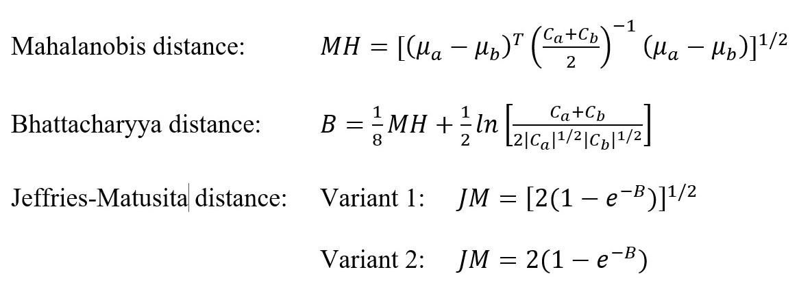
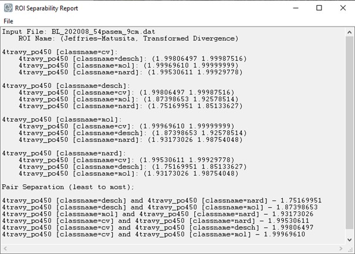

# Case study: Seasonal spectral separability of selected grass species of the Krkonoše Mts. tundra ecosystem

This case study focuses on the separability of different grass species in Krkonoše Mts. 
during the vegetation growing season. It is inspired by a study by [Červená et al. (2020)](#references), 
where differences in optical properties of three grass species were investigated on three scale levels: 
green leaf spectra measured by the spectroradiometer ASD FieldSpec4 Wide-Res coupled with a contact probe in laboratory conditions (leaf level), 
canopy spectra measured by the same spectroradiometer using the fiber optic cable with a pistol grip in the field (canopy level), and hyperspectral image data acquired with the Nano-Hyperspec® fastened to the DJI Matrice 600 Pro drone (image level). 

## Objectives

The objectives of this case study are as follows:

* test the separability of four grass species during the 2020 vegetation season at the image level using statistical tests for each wavelength,

* separability analysis (Jeffries-Matusita distance) in R. 

To get familiar with the area of interest, see [Tundra vegetation monitoring in Krkonoše Mountains](../../data_usecases/usecase_grasses_krkonose.md) in the Use Cases and Data section of the course.

## Data

Hyperspectral images acquired with the Headwall Nano-Hyperspec® fastened to the DJI Matrice 600 Pro drone on June 16th, July 13th, and August 11th, 2020 (*Figure 1*) were resampled from 269 spectral bands to 54 bands (to eliminate noise and correlation in neighboring bands),
and ground sampling distance was reduced from 3 to 9 cm.
For every of the four dominant grass species (*Nardus stricta* (`nard`) and competitive grasses *Calamagrostis villosa* (`cv`), *Molinia caerulea* (`mol`), and *Deschampsia cespitosa* (`desch`)) 450 random pixels were selected (*Figure 1*).
Spectral curves for these pixels were extracted based on all three hyperspectral images. The results are in a table, where the first column is called `classname` and contains class values `desch`, `cv`, `mol`, and `nard`, and the rest are columns with reflectance for each band in each month (e.g., `b1_2006` is band 1 of image acquired in June 2020, etc.). 
Data [(module4/case_study_spectral_separability_grass)](https://doi.org/10.5281/zenodo.10003574) is available in three text files, each for every month (`Rin_grasses_2020_month.txt`).

<p align="center">

</p>

*Figure 1. Hyperspectral data acquired in June (upper left), July (upper right), and August (lower) 2020. In the August image, there are also 450 random pixels selected for each of the four studied species.*

<p align="center">

</p>

*Figure 2. The first ten rows of the table containing exported reflectance for 450 randomly selected pixels for each species.*


## Methods

### Separability analysis – Jeffries-Matusita distance

Separability analysis is often performed on the training data to find out whether all the defined classes will be distinguishable from each other. It can also help to estimate the expected error in the classification for various feature (band) combinations. 
Separability measures include, for example, Euclidean distance, Transformed divergence, Mahalanobis distance and its improved variants, Bhattacharyya distance and Jeffries-Matusita distance; for formulas, see *Figure 3* [(Schowengerdt, 2007)](#references). 
We will use the Jeffries-Matusita distance (JM distance). 
This analysis expects a normal distribution of the input data. 
Be aware that there are two formulas (*Figure 3*) for computing this separability measure. 
The most used formula in remote sensing is the one without the square root (*Figure 3, variant 2*). 
This variant is also used in the ENVI software. It can take values in the range [0, 2], where values greater than 1.9 indicate good separability of the classes; in case of separability lower than 1, it is probably a good idea to combine classes. 
However, originally the formula was defined with the square root (*Figure 3, variant 1*), so it means the values in the range [0, √2]. 
This formula is used, for example, in package varSel in R (Dalponte et al., 2013). 
As it is open source [code](https://rdrr.io/cran/varSel/src/R/JMdist.R), you can easily edit the function to the variant 2 used in ENVI and [Richards (2013)](#references); see also *Code 1*.

<p align="center">

</p>

*Figure 3. Formulas for Mahalanobis, Bhattacharyya, and Jeffries-Matusita distances. μ are means and C are covariance matrices. [(Richards, 2013; Schowengerdt, 2007)](#references).*
```
JMdist2 <- function(g,X){

  X<-as.matrix(X)

  nfeat <- ncol(X)
  nclass <- length(unique(g))

  mu <- by(X,g,colMeans)

  Cov <- by(X,g,stats::cov)

  ncomb <- t(utils::combn(unique(g),2))
  Bhat <- c()
  jm <- c()
  for(j in 1:nrow(ncomb)){
    mu.i <- mu[[ncomb[j,1]]]
    cov.i <- Cov[[ncomb[j,1]]]
    mu.j <- mu[[ncomb[j,2]]]
    cov.j <- Cov[[ncomb[j,2]]]
    if(nfeat==1){
      Bhat[j]<-(1/8)*t(mu.i-mu.j) %*% (solve((cov.i+cov.j)/2)) %*% (mu.i-mu.j) + 0.5*log((((cov.i+cov.j)/2))/(sqrt((cov.i))*sqrt((cov.j))),base=exp(1))
    }else{
      Bhat[j]<-(1/8)*t(mu.i-mu.j) %*% (solve((cov.i+cov.j)/2)) %*% (mu.i-mu.j) + 0.5*log(det(((cov.i+cov.j)/2))/(sqrt(det(cov.i))*sqrt(det(cov.j))),base=exp(1))
    }
    jm[j] <- (2*(1-exp(-Bhat[j])))
  }

  return(list(classComb=ncomb,jmdist=jm))
```

*Code 1. Definition of the function JMdist2 in R: JM distance calculated based on [Richards (2013)](#references) and how it is used in ENVI, code edited based on https://rdrr.io/cran/varSel/src/R/JMdist.R. Available as a file* <a href=JMdist2_function.R download>JMdist2_function.R</a>.

JM distance can be calculated for all available bands together, so you will get one separability number based on all used bands (like in the ENVI software). 
But it can also be calculated for separate bands; in this case, it shows which bands are better for separating the classes. 
With the function defined in Code 1, you can calculate both, but for separate bands, it is necessary to use the function in a loop (Code 2).

```
data=read.delim("Rin_grasses_2020_08.txt");

fix(data)

d=dim(data)
d

attach(data)

# JM distance for all bands together
JMdist2(classname, data[,2:55])

# JM distance for separate bands (August example, rename the output text file for other months)
results <- matrix() # definition of the empty matrix 
JM_band1 <- JMdist2(classname, data[,2]) # calculation of JM distance for the first band
JM_band1 # JM distance for the first band, you can copy the combination of classes here, it remains the same also in the loop
results <- JM_band1$jmdist # save the JM distance for first band to the empty matrix (it gives the structure to the matrix)

for (I in 3:55) # the loop for bands 2 - 54
{
	JM_band <- JMdist2(classname, data[,I])	# calculate JM distance for band I 
	results <- rbind(results, JM_band$jmdist); # save result for the I band as a new row to the matrix "results"
}

write.table(results, "JM_distance2_bands_August.txt") # save the results for all the bands to the text file
```

*Code 2. Calculation of JM distance for all bands together and separate bands; example on August data. Available also as a file* <a href=Script_JM_distance.R download>Script_JM_distance.R</a>.

### ANOVA, Welch's t-test, Wilcoxon test
Another way to evaluate differences among the classes is to run one of the commonly used statistical tests to find out if the two population means are the same (Welch’s t-test, in comparison to the well-known Student’s t-test, is designed for unequal population variances). That means it has to be done in a loop for every band and for every combination of two classes. For all classes, you can compute the Analysis of variance (ANOVA). It can indicate whether at least one species' reflectance in a given band significantly differs from all others. However, it is unclear whether there are significant differences between all of the classes or whether only one class differs from the others. According to the null hypothesis, the mean reflectance values for the two compared species are the same at a given wavelength. The null hypothesis is rejected when the p-value is less than a pre-specified significance level, which is usually set to 0.05. In a loop, you can save p-values for every band and then visualize the results and interpret them. Both of the above-mentioned methods assume the normality of input data. If the data does not have a normal distribution, an alternative to Welch's t-test is the Wilcoxon rank test. 
The example script for both tests is in the attachment `Script_ttest_wilcox.txt`.

## Results

First, let's examine the results of JM distance for all bands together (see *Figure 4*). 
All of the grasses have good separability throughout the season. *Calamagrostis villosa* (`cv`) and *Molinia caerulea* (`mol`) are the most separable species in all months, 
while *Nardus stricta* (`nard`) and *Molinia caerulea* (`mol`) are the least separable in June and July; 
however, their separability is good in August. 
*Deschampsia cespitosa* (`desch`) can be distinguished from *Nardus stricta* (`nard`) in June and July, but not in August. 
Just for comparison, *Figure 5* shows ENVI results, for example, for August data; the results are identical.

<p align="center">

</p>

*Figure 4. JM distance calculated in R for all bands combined for all months and species combinations (greener = better separability).*

<p align="center">

</p>

*Figure 5. Separability report from the ENVI software showing JM distance and transformed divergence for the August dataset.*

*Figure 6* shows the results calculated for separate bands (JM distance, T-test, and Wilcoxon test) and average reflectance spectra. 
When only one band is used, JM distance values are generally lower (maximal values around 1.7) than when all bands are used (minimal value is 1.7). 
JM distance reaches low values for all species combinations in all months in the red edge area (around 720 nm). 
When we look at average spectra, there is a crossing of spectral curves. 
Similarly, lower JM distances at shorter wavelengths (blue and green) in July can be explained by the similarity of all of the spectral curves. 
On the contrary, the largest spectral curve differences between `desch` and `mol` in the red band in June and between `desch` and `cv` in the near infrared band in August result in the largest JM distances. 
Both statistical tests are less sensitive than JM distance, but when one of the tests has a very high p-value (i.e., the null hypothesis of equal mean reflectance values for two compared species is rejected at significance level 0.05), JM distance is also very low.

[  ](media/results_separate_band.jpg)

*Figure 6. Average spectra (reflectance * 10000), JM distance, and p-values of Welch’s t-test and Wilcoxon rank test for all months and species calculated for separate bands in R.*

## Conclusions
In this case study, we proved that all four grass species are separable based on the given hyperspectral dataset in all compared months in a season (June, July, and August). 
However, separability based on JM distance is lower for *Nardus stricta* (`nard`) and *Molinia caerulea* (`mol`) in June and July and for *Deschampsia cespitosa* (`desch`) and *Nardus stricta* (`nard`) in August. 
The best separability in all months is reached for *Molinia caerulea* (`mol`) and *Calamagrostis villosa* (`cv`). 
Separability measured by JM distance based on only one band was generally lower. 
The species were usually inseparable at bands around 720 nm, where all the spectral curves meet. 
We showed that JM distance is a better indicator of class separability than the commonly used statistical tests such as Welch’s t-test or Wilcoxon rank test.

## References

Červená, L., Kupková, L., Potůčková, M., Lysák, J. (2020). SEASONAL SPECTRAL SEPARABILITY OF SELECTED GRASSES: CASE STUDY FROM THE KRKONOŠE MTS. TUNDRA ECOSYSTEM. Int. Arch. Photogramm. Remote Sens. Spat. Inf. Sci. XLIII-B3-2020, 371–376. [10.5194/isprs-archives-XLIII-B3-2020-371-2020](https://doi.org/10.5194/isprs-archives-XLIII-B3-2020-371-2020).

Dalponte, M., Orka, H.O., Gobakken, T., Gianelle, D., Naesset, E. (2013). Tree Species Classification in Boreal Forests With Hyperspectral Data. IEEE Trans. Geosci. Remote Sens. 51, 2632–2645. [10.1109/TGRS.2012.2216272](https://doi.org/10.1109/TGRS.2012.2216272).

Richards, J.A. (2013). Remote sensing digital image analysis: an introduction. Fifth edition. ed. Springer, Berlin.

Schowengerdt, R.A. (2007). Remote sensing, models, and methods for image processing. 3rd ed. ed. Academic Press, Burlington, MA.

### Next unit
Proceed with a case study on [discrimination of selected grass species from time series of RPAS hyperspectral imagery](../06_Krkonose_tundra_grasslands/06_Krkonose_tundra_grasslands.md)

