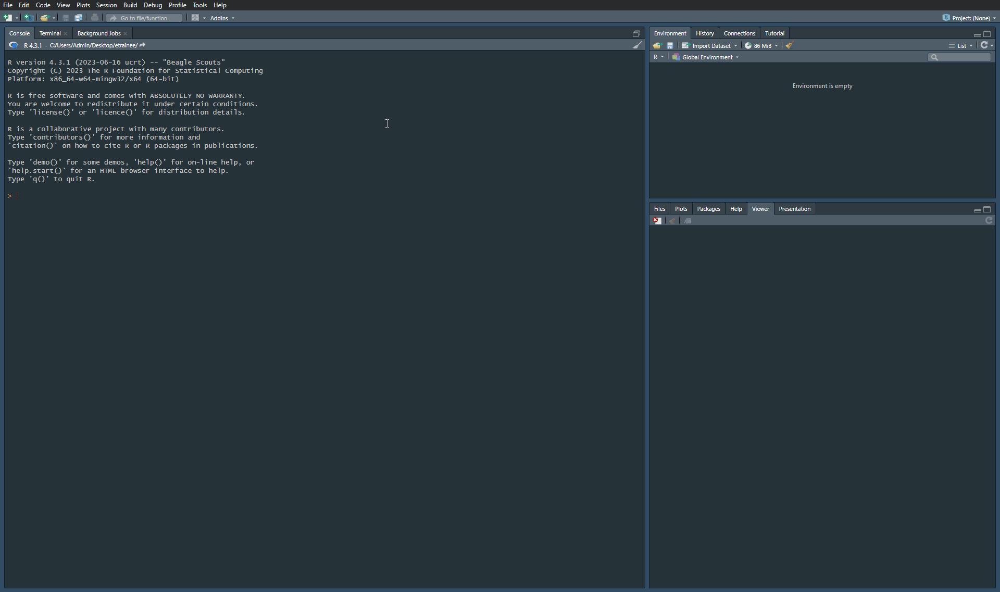

# R language

R is a scripting/programming language suitable for statistical computing. It offers a wide range of
tools for statistical data analysis, including graphics:
  
[https://www.r-project.org/](https://www.r-project.org/)

It is a free software developed released under the GNU General Public License.

## Download and installation

R can be extended by RStudio, an integrated development environment (IDE) which makes working in R significantly easier.

Firstly, install the core R package from the Comprehensive R Archive Network (CRAN) website:

[https://cran.r-project.org](https://cran.r-project.org)

The installation and administration guidelines are available on the R-project homepage:  

[https://cran.r-project.org/doc/manuals/r-release/R-admin.html](https://cran.r-project.org/doc/manuals/r-release/R-admin.html)

After installing R, RStudio can be downloaded and installed from:

[https://posit.co/download/rstudio-desktop/](https://posit.co/download/rstudio-desktop/)

We recommend installing everything with default settings.


### Module 2 environment

***Note: If you encounter any errors during each of installation steps you may need to temporarily disable your firewall or anti-virus software.***

Module 2 contents use R version 4.3.1 "Beagle Scouts". Choose files appropriate for your operating system here [https://cran.r-project.org/](https://cran.r-project.org/). For Windows version use this link to download installer: [https://cran.r-project.org/bin/windows/base/R-4.3.1-win.exe](https://cran.r-project.org/bin/windows/base/R-4.3.1-win.exe).


If you use R on Windows some packages may need RTools software. Download and install version 4.3 of RTools from this website: [https://cran.r-project.org/bin/windows/Rtools/rtools43/rtools.html](https://cran.r-project.org/bin/windows/Rtools/rtools43/rtools.html)


A recommended way to setup working environment in RStudio is to use [renv (short for reproducible environment) package](https://github.com/rstudio/renv). Project created using these instructions will contain appropriate versions of packages used to develop and run scripts in Module 2.

**Instructions**


**Step 1.** Before creating R environment make sure you have downloaded Module 2 data packages from [Zenodo](https://zenodo.org/records/10003575).  

**Step 2.** Create a new catalogue and name it **module2**. Move the downloaded data packages to this folder. Unzip the data inside this catalogue and remove *module2_* from the folder names. This is what your **module2** catalogue should look like after completing Step 2.


<center>


</center>

**Step 3.** Launch RStudio  
**Step 4.** Check out you R version. After you launch RStudio the first line in the console should read

```
R version 4.3.1 (2023-06-16 ucrt) -- "Beagle Scouts"
```

If you have different R versions installed make sure to change version to R 4.3.1 as shown below

**Click on the GIF to open full size version in a new tab**

<center>
<a href="../assets/r_envs/r_version.gif" target="_blank">
    
</a>
</center> 

---

**Step 5.** Create a New Project. Connect it with existing directory. Change the path to **module2** data catalog, in which you unzipped packages with data. 

**Click on the GIF to open full size version in a new tab**

---

<center>
<a href="../assets/r_envs/r_newproj.gif" target="_blank">
    
</a>
</center> 

---
**Step 6.** Install `renv` using `install.packages("renv")` command in the console   
**Step 7.** Load `renv` package executing `library(renv)` in the console   
**Step 8.** Use `renv::init()` to initialize `renv` within a project created in Step 5.  
**Step 9.** Replace the default `renv.lock` file inside the project folder with the downloaded one: <a href=../assets/r_envs/renv.lock download>download renv.lock</a>  
**Step 10.** Use `renv::restore()` to install specific package versions recorded in the lockfile. When prompted type `y` in the console to install packages recorded in `renv.lock` file  

By following these steps you ensure that you will work on the most up-to-date environment that the contents of Module 2 use. To work in a project just open `.Rproj` file. This action will open RStudio with you environment setup.

If you followed the recommended steps this is the content of **module2** folder you should be seeing. Note that after unzipping you can safely remove `.zip` packages from this folder.


<center>


</center>

***Note: To ensure compatibility and consistent results across exercises, please adhere to the following specified versions of R and packages. Running exercises on different versions may lead to unexpected results and potential inconsistencies and errors.***


## Getting started / external material

If you are new to R / programming, consider going through one or more of these tutorials first:

Introduction to the R language and statistical analysis:  
[https://cran.r-project.org/doc/manuals/r-release/R-intro.html](https://cran.r-project.org/doc/manuals/r-release/R-intro.html)

Instructions on how to import and export data using R and respective packages:  
[https://cran.r-project.org/doc/manuals/r-release/R-data.html](https://cran.r-project.org/doc/manuals/r-release/R-data.html)
