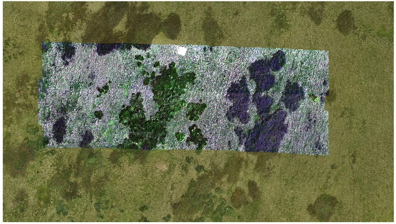
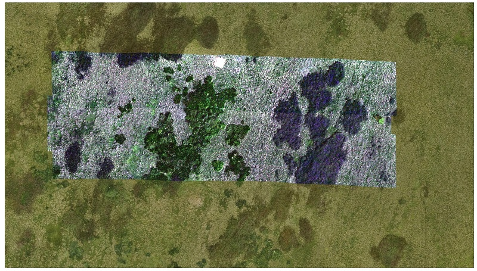

## Report 

##### Data preparation, relative and absolute accuracy

The provided hyperspectral image strips were loaded and visualized in the QGIS environment, along with the positions of the checkpoints.
The difference between the XY coordinates of the checkpoints in the image strips and in the shapefile was determined. 
In addition, four identical points were found in strip (line) pairs 2 and 3, 3 and 4, and the difference between their XY coordinates was analyzed.
The horizontal shift, standard deviation, and Root Mean Square Error (RMSE) from both relative and absolute residuals were computed.

<i>"Raw" image data</i>

|  |           |                        |          |   |                      |           |                        |          |
|:-----------------:|:---------:|:----------------------:|:--------:|:---:|:--------------------:|:---------:|:----------------------:|:--------:|
| **Absolute accuracy** | shift [m] | standard deviation [m] | RMSE [m] |   | **Relative accuracy**    | shift [m] | standard deviation [m] | RMSE [m] |
| strip (line) 2    | 0.35      | 0.04                   | 0.35     |   | strip (line) 2 and 3 | 2.01      | 0.32                   | 2.03     |
| strip (line) 3    | 1.28      | 0.51                   | 1.71     |   | strip (line) 3 and 4 | 1.50      | 0.12                   | 1.50     |
| strip (line) 4    | 0.39      | 0.08                   | 0.40     |

##### Image registration

The orthorectified RGB image with a defined CRS (EPSG:5514) was loaded and used as a base for coregistration and orthorectification of the hyperspectral image strips. 
In the "Georeferencer" app, at least five identical points were evenly collected throughout the area. The "Transformation type" Polynomial 1 (1st order polynomial) and Thin plate spline were tested. 
As for the "Resampling method", Nearest neighbour was used. The procedure was repeated for each image strip (line). 

<i>Geometrically corrected hyperspectral image strips - affine transformation</i>

      

<i>Geometrically corrected hyperspectral image strips - spline transformation</i>

 

The residuals on the GCPs after the transformation were found in the generated PDF report, and their mean was computed.

<i>GCP residuals</i>

|   |                               |   |                       |
|:--------------:|:-----------------------------:|:---:|:---------------------:|
| **mean [m]**       | 1st polynomial transformation |   | spline transformation |
| strip (line) 2 | 0.04                          |   | 0.00                  |
| strip (line) 3 | 0.03                          |   | 0.00                  |
| strip (line) 4 | 0.01                          |   | 0.00                  |

##### Accuracy assessment

The relative and absolute accuracy of the orthorectified hyperspectral image strips was assessed using the same procedure as before. 

<i>1st polynomial transformation</i>

|                   |           |                        |          |   |                      |           |                        |          |
|:-----------------:|:---------:|:----------------------:|:--------:|:---:|:--------------------:|:---------:|:----------------------:|:--------:|
| **Absolute accuracy** | shift [m] | standard deviation [m] | RMSE [m] |   | **Relative accuracy**   | shift [m] | standard deviation [m] | RMSE [m] |
| strip (line) 2    | 0.08      | 0.05                   | 0.09     |   | strip (line) 2 and 3 | 0.13      | 0.08                   | 0.14     |
| strip (line) 3    | 0.06      | 0.03                   | 0.07     |   | strip (line) 3 and 4 | 0.12      | 0.08                   | 0.14     |
| strip (line) 4    | 0.04      | 0.02                   | 0.04     |

<i>Spline transformation</i>

|                   |           |                        |          |   |                      |           |                        |          |
|:-----------------:|:---------:|:----------------------:|:--------:|:---:|:--------------------:|:---------:|:----------------------:|:--------:|
| **Absolute accuracy** | shift [m] | standard deviation [m] | RMSE [m] |   | **Relative accuracy**    | shift [m] | standard deviation [m] | RMSE [m] |
| strip (line) 2    | 0.09      | 0.05                   | 0.11     |   | strip (line) 2 and 3 | 0.13      | 0.04                   | 0.14     |
| strip (line) 3    | 0.07      | 0.04                   | 0.08     |   | strip (line) 3 and 4 | 0.12      | 0.07                   | 0.13     |
| strip (line) 4    | 0.05      | 0.01                   | 0.06     |

##### Q&A 

* Evaluate the absolute and relative accuracy after geometric correction. What is the maximum error? Is the resulting accuracy sufficient?  
    + using 1st polynomial transformation the shift values reach 0.04-0.08 m with a maximum standard deviation of 0.05 m; shift between the individual strips pairs is 0.12-0.13 m
    + using spline transformation the shift values reach 0.05-0.09 m with a maximum standard deviation of 0.05 m; shift between the individual strips pairs is 0.12-0.13 m
    + the maximum RMSE on check points is 0.11 m for strip (line) 2 after spline transformation 
    + resulting accuracy is sufficient for most applications
* Compare the “raw” image strips with the geometrically corrected (orthorectified) image strips in terms of computed accuracy and visual inspection.  
    + in terms of absolute accuracy, the shift values decreased from 0.35-1.28 m to sub 0.1 m
    + in terms of relative accuracy, the shift values decreased from meter to sub 0.15 m 
    + visually the shifts and deformations of the overlapping strips are significantly reduced
* Are there any differences between the results of the spline and polynomial transformations?  
    + residuals on the GCPs after spline transformation are 0.00 m as local deformations are introduced to the image
    + residuals on the GCPs after 1st polynomial transformation are up to 0.04 m 
    + however, relative and absolute accuracy assessed on the check points reaches similar values
    + visually the orthorectified hyperspectral image strips do not differ significantly  
* Comment on the used resampling method: what does “Nearest neighbour” ensure? Would using a different resampling type affect the image, and if yes, then how?  
    + value to a cell/pixel in the output raster is assigned from the closest input cell/pixel
    + original input pixel/cell values are retained
    + different resampling methods such as bilinear interpolation or cubic convolution introduce new pixel/cell values
    
### Back to theme 
Proceed by returning to [Aerial/RPAS hyperspectral data acquisition and pre-processing](../02_aerial_acquisition_preprocessing.md)
