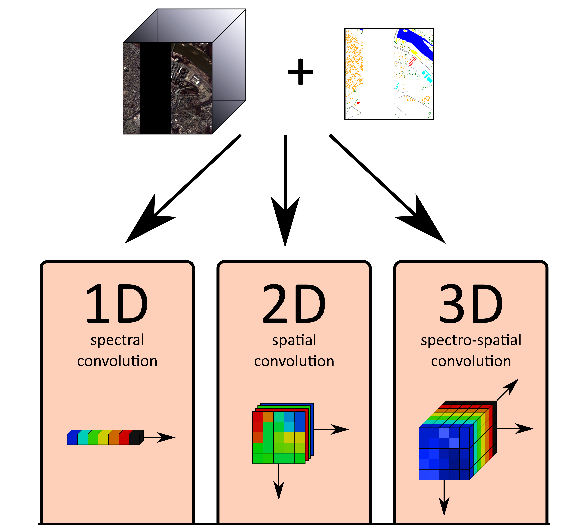

# Classification of hyperspectral data using CNNs

The aim of this exercise is to get acquainted with 1D, 2D and 3D Convolutional Neural Networks (CNNs), in order to understand how different network structures extract spectral, spatial and spectro-spatial information and how that influences the resulting classification.

**Tasks:**

   - Reading and understanding the code
   - Training a neural network of your choice
   - Experimenting with hyperparameter settings

This exercise introduces three types of convolutional neural networks via three Jupyter notebooks. Each notebook represents a different approach to classification of hyperspectral imagery:

- [spectral (1D)](04_exercise_cnn_1d.ipynb)
- [spatial (2D)](04_exercise_cnn_2d.ipynb)
- [spectro-spatial (3D)](04_exercise_cnn_3d.ipynb)

The notebooks are currently setup to use the Pavia City Centre dataset, however any GDAL-readable rasters can be used instead. Function _image_preprocessing.read_gdal()_ takes paths to a training data raster and a reference data raster as parameters. Both need to have the same extent and pixel size.

## Background

spectral 1D - As the name suggests, this network performs convolution only along the spectral dimension. In other words it classifies one pixel at a time without taking spatial relationships into account. Convolutional layers may be followed by fully connected layers which perform the final classification.

spatial 2D - Spatial CNNs are most commonly used for classification of multispectral data, as well as for general Computer Vision tasks. Convolution is performed along the spatial dimensions while the spectral bands get stacked into input feature maps. For hyperspectral data, spatial networks may be preceded by dimensionality reduction (often using PCA).

spectro-spatial 3D - This network structure use two dimensions for spatial information, with the third dimension . ex...
Most complex of the presented networks, 3D CNNs require considerably higher computational power and more memory than the other two presented CNN arcitectures.

## 1. Setting up the environment

All the code can be run either on local machines, or in the cloud, for example through Google Colab. We currently recommend using Google Colab as it is significantly easier to set up and faster to run. However it requires a Google account to use.

### 1.1 Google Colab

Open the corresponding links to individual notebooks and copy them to your own google drive:

- Spectral 1D CNN: [https://colab.research.google.com/drive/1j3We3QNMvUEr2VOxzTbLiiPClc2OeI2w](https://colab.research.google.com/drive/1j3We3QNMvUEr2VOxzTbLiiPClc2OeI2w)
	
- Spatial 2D CNN: [https://colab.research.google.com/drive/14TGYe7o3U9KnAzy--Qstg3Fh6fH39Qum](https://colab.research.google.com/drive/14TGYe7o3U9KnAzy--Qstg3Fh6fH39Qum)
	
- Spectro-Spatial 3D CNN: [https://colab.research.google.com/drive/1SDnv1Ybu2Fm554Vu-FLWlhR1qaDhwCeJ](https://colab.research.google.com/drive/1SDnv1Ybu2Fm554Vu-FLWlhR1qaDhwCeJ)

When opening the links, make sure to change the runtime to use a GPU. To do that, go to <i>Menu > Runtime > Change runtime</i>. There, change <i>hardware acceleration</i> to GPU.

### 1.2 Local machine
The installation guide is created for Windows. If using MacOS/Linux, most of the process remains the same, except you may need to install GDAL Python API in a different way and it may not be possible use your GPU, given the CUDA toolkit may not be available on your system.

If you already have some experience with Python, you may likely skip to installing external libraries:

* Python installation
* Virtual environment setup (optional)
* Installing GDAL Python API
* Installing PyTorch
* Installing most external libraries
* Running jupyter notebook

#### 1.2d Installing PyTorch
Suitable command for PyTorch installation should be selected on the [PyTorch website](https://pytorch.org/get-started/locally/) based on if your computer has a GPU by Nvidia:
* If you have a Nvidia CUDA-capable GPU then you can install _CUDA toolkit_ and _CuDNN_ from the [Nvidia website](https://developer.nvidia.com/cuda-toolkit), you need to sign up for 'NVIDIA Developer Program' in order to download CuDNN (check the PyTorch website first, so you install an appropriate version of _CUDA_ and _CuDNN_). After successfully installing _CUDA toolkit_ and _CuDNN_, install PyTorch using the command from the [PyTorch website](https://pytorch.org/get-started/locally/). All models were tested with Python 3.9, CUDA version 10.1, CuDNN 7.6 and PyTorch 1.8.1.
* If you do not have a CUDA-capable Nvidia GPU, you can simply use PyTorch on the CPU, by selecting `CPU` in the _Compute Platform_ field on the [PyTorch website](https://pytorch.org/get-started/locally/). All models were tested with Python 3.9 and PyTorch 1.10.2.

## 2. Go through the code
Read the code explanation for at least one of the networks and try to understand it. You will hopefully get an idea of why perform the different preprocessing operations, what the network structure represents and how the training procedure works.

## 3. Train a CNN of your choice
Train networks for classification

## 4. Alter hyperparameters and observe
Try changing up some hyperparameters - primarily the number of training epochs, learning rate, batch size or class weights

## 5. Compare your result with our samples
Each notebook contains a sample solution that we provide at the end of the exercise, as well as a pretrained network you can try.

## Back to theme
Proceed by returning to [Machine learning in imaging spectroscopy](04_time_series_specifics.md)
